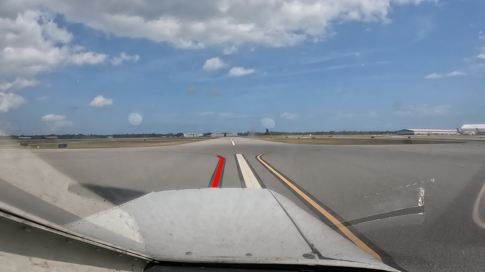
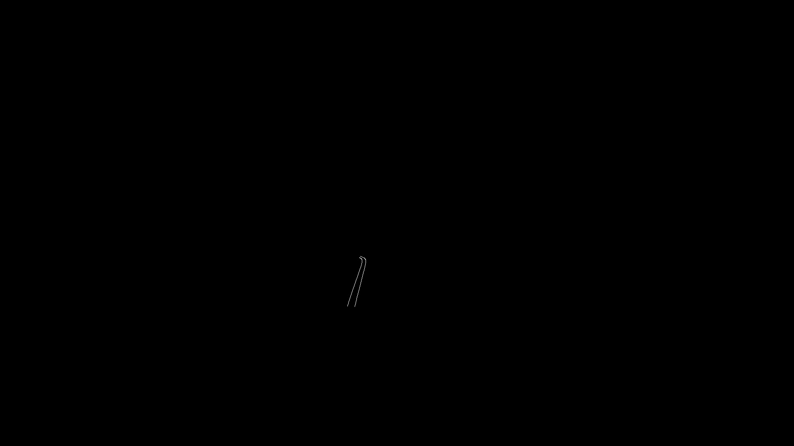

# ALINA — Background

[Back to README](README.md)

Sources: the paper *ALINA: Advanced Line Identification and Notation Algorithm* (Khan, Ganeriwala, Bhattacharyya, Neogi, Muthalagu — CVPR 2024 Workshop on Vision Datasets Understanding, [arXiv:2406.08775v2](https://arxiv.org/abs/2406.08775)) and the code in this repository (`alina/`, `eval/`, `data/`, `cli.py`).

---

<a id="what-is-alina"></a>

## 1. What is ALINA?

<a id="plain-english-explanation"></a>

### Plain-English explanation

ALINA is an **automatic labeling tool** for airport taxiway videos. It is not a neural network. It is a classical computer-vision pipeline that finds the yellow centerline painted on a taxiway and records exactly which pixels belong to it.

The cameras sit inside the cockpit of a small aircraft and look forward as it taxis. For each video frame, ALINA writes two outputs:

1. an **annotated image**, with the line-marking pixels painted red, and
2. a **text file** listing the `x y` pixel coordinates of every line-marking pixel. If the frame has no line, the file is empty.



Those labels can then be used to **train supervised machine-learning models**, such as taxiway or lane detectors, which need large amounts of pixel-accurate ground truth.

<a id="value-proposition"></a>

### Value proposition and purpose

| Problem | How ALINA addresses it |
|---|---|
| Supervised ML needs labels, and manual or crowd-sourced labeling is slow, expensive, error-prone, and can raise data-privacy concerns | Labels frames automatically at about **19.65 fps** (50.09 ms per frame on a CPU) |
| About **33%** of aircraft accidents between 2015 and 2022 happened during taxiing (Aviation Safety Network) | Produces labeled data that future pilot-assist or autonomous taxi-guidance systems can be trained on |
| The previous method, **CDLEM** (Canny, then Hough transform, Ramer-Douglas-Peucker, and Bresenham), needed a new hand-drawn ROI at **every scenario change**: 120 ROIs for 60,249 frames | ALINA needs **one ROI per video**: **3 ROIs** for the same 60,249 frames |
| CDLEM's detection rate was 91.14% at 120.35 ms per frame | ALINA's detection rate is **98.45%** at 50.09 ms per frame (about 2.4× faster) |

Scale: ALINA labeled **60,249 frames** from 3 videos, a subset of the roughly 300,000-frame **AssistTaxi** dataset recorded at Melbourne (MLB) and Grant-Valkaria (X59) airports. The videos cover different camera angles and both sunny and cloudy weather.

<a id="thought-process"></a>

### Thought process: how the authors approached the problem

The design is a sequence of steps. Each step shrinks the problem or removes one source of error:

1. **Restrict where to look (ROI).** The centerline always appears in roughly the same area in front of the nose of the aircraft. The user clicks a trapezoid around that area **once, on the first frame**. The same trapezoid is reused for every later frame of that video. This cuts computation and excludes the sky, grass, and parked aircraft.
2. **Remove perspective distortion (bird's-eye warp).** Seen from the cockpit, parallel lines converge toward the horizon. A homography matrix `M` (3×3, solved from 4 source and 4 destination points) warps the trapezoid into a top-down rectangle. In that view, line markings look like roughly vertical stripes with consistent width.
3. **Make color robust to lighting (HSV + min-max normalization).** The image is converted from RGB to HSV, and each channel is stretched to the range [0, 255]. This makes the "yellow paint" signature comparable between sunny and cloudy frames.
4. **Separate paint from pavement (HSV thresholding).** Pixels inside the HSV range (0, 70, 170) to (255, 255, 255) become white (255) and everything else becomes black (0). The bounds were chosen from histograms of real line-marking pixels. The result is a binary mask, which still contains some noise.
5. **Decide whether a line is present and where (vertical histogram).** For each column of the mask, count the white pixels. A real line in the bird's-eye view forms a tall column, so it produces a clear **peak**. Noise produces only small bumps. The ablation study set a peak threshold:

   | Threshold | False positives |
   |---|---|
   | 0 | 83.33% |
   | 75 | 22.22% |
   | **150** (chosen) | **0%** |

   If the peak is below the threshold, the frame is saved with an empty label file.
6. **Collect the whole line, including curves and dashes (CIRCLEDAT).** Starting from the centroid of the peak column, a depth-first traversal jumps across nearby white pixels and gathers every pixel connected to that line. Noise that is not connected to the line is left out.
7. **Map the result back (unwarp).** The inverse homography `M⁻¹` projects the collected pixels back into the original camera view. ALINA then paints them red and writes their coordinates.
8. **Validate against hand-made ground truth (CBEM).** 120 frames were picked at scenario changes. For each one, a human outlined the line marking and Canny edge detection produced edge-pixel ground truth. ALINA's recall against that set is 98.45%.

<a id="key-concepts"></a>

### Key concepts and findings

- **ROI defined once per video.** This is the main usability gain over CDLEM: 3 ROIs instead of 120.
- **CIRCLEDAT** is a new traversal algorithm with cost **O(k)**, where k is the number of line pixels. A sliding-window search costs **O(m×n)** over the whole frame. Measured time: **3.33 ms vs. 10.90 ms**.
- **Detection rate (recall) = TP / (TP + FN) = 98.45%.** The authors prioritize recall because, for taxiway safety, a missed marking is worse than an extra pixel.
- **Processing-time breakdown (ms per frame):**

  | Step | Time (ms) |
  |---|---|
  | Perspective warp | 4.41 |
  | HSV normalization | 5.91 |
  | Thresholding | 1.05 |
  | **Histogram** | **28.71** (the bottleneck) |
  | CIRCLEDAT | 3.33 |
  | Remap | 6.68 |
  | **Total** | **50.09** |

- **Ground-truth sample size of 120 frames.** The authors justify it with the Law of Large Numbers and the Central Limit Theorem. The frames were picked at **scenario shifts**, not at random.
- **Limitations and future work.** The ROI is fixed per video, so a large camera move or a sharp turn can push the line out of the ROI. The HSV bounds and thresholds are hand-tuned. Only the single strongest peak, which is one line, is traversed per frame. Applying ALINA to car-lane datasets is listed as future work.

---

<a id="input-files"></a>

## 2. Which input files are provided to ALINA? (folders)

ALINA's actual input is a **folder of `.jpg` video frames** (one folder per video) plus **4 ROI clicks** on the first frame. A raw video can first be split into frames with `alina video-to-frames`. The repository's `data/` folder contains:

```
data/
├── Raw_Data/                     # INPUT: raw frames extracted from 3 taxiway videos
│   ├── vidd_1/                   #   50 frames, 00001.jpg …  (3840×2160, 4K)
│   ├── vidd_2/                   #   50 frames, 00001.jpg …  (1920×1080)
│   └── vidd_3/                   #   50 frames, 18970.jpg …  (1920×1080)
│
├── Labeled_Data/                 # SAMPLE OUTPUT of ALINA on the raw frames
│   ├── vidd_1/ { annotations/ (red-overlay .jpg), textfiles/ (x y .txt) }
│   ├── vidd_2/ { annotations/, textfiles/ }
│   └── vidd_3/ { annotations/, textfiles/ }
│
└── gt_alina_labels/              # EVALUATION set (120 frames = 3 × 40)
    ├── canny_images/             #   CBEM edge-map images (visual reference)
    │   ├── canny_images_1/       #     00002_canny.jpg …
    │   ├── canny_images_2/
    │   └── canny_images_3/       #     37250_canny.jpg … 41536_canny.jpg
    ├── canny_textfiles/          #   CBEM ground-truth coordinates (x y per line)
    │   ├── canny_textfiles_1/
    │   ├── canny_textfiles_2/
    │   └── canny_textfiles_3/
    └── ALINA_textfiles/          #   ALINA's output on the same 120 frames
        ├── ALINA_textfiles_1/
        ├── ALINA_textfiles_2/
        └── ALINA_textfiles_3/
```

The `_1`, `_2`, and `_3` folders correspond to the three videos and camera perspectives. `canny_textfiles_N` is paired with `ALINA_textfiles_N` **by position and by file name**, for example `canny_textfiles_1/00002.txt` with `ALINA_textfiles_1/00002.txt`.

---

<a id="what-is-cbem"></a>

## 3. What is CBEM?

**CBEM = Context-Based Edge Map.** It is the **manually created ground truth** used to score ALINA and CDLEM. It answers the question: where are the true edges of the taxiway line marking in this frame?

It is called "context-based" because a human supplies the context. The person outlines **only the line marking**, so other edges in the frame (aircraft, grass borders, the cockpit) are excluded. Following Canny's criteria, the edge map focuses on edge-pixel presence, corner localization, thick edges, and edge connectivity.

How a CBEM is created (paper Section 4.3; `eval/cbem.py`, `alina cbem`):

1. **Outline the contour region.** Click and drag around the marking. This produces a polygon mask.
2. **Pre-process.** Convert to grayscale, keep only the pixels inside the mask, and apply a 5×5 Gaussian blur. Canny then computes gradient magnitude and direction and applies non-maximum suppression.
3. **Run Canny edge detection** inside the region. The resulting edge pixels are the ground truth. The image is saved as `*_cbem.jpg` (in the repo's data, `*_canny.jpg`) and the coordinates as a `.txt` file.

Built for **120 frames** (40 per video) chosen at scenario shifts. Example CBEM for the frame shown above:



---

<a id="canny-images"></a>

## 4. What are Canny images?

**Canny images** (`data/gt_alina_labels/canny_images/canny_images_{1,2,3}/*_canny.jpg`) are the **visual form of the CBEM**. Each one is a black image, the same size as the frame, where **white pixels are the edges of the taxiway line marking** detected by the **Canny edge detector** (John Canny, 1986) inside the hand-drawn outline.

Canny edge detection, briefly:

1. Gaussian smoothing to reduce noise.
2. Sobel gradients to get the strength and direction of each edge.
3. **Non-maximum suppression** to thin edges down to 1 pixel wide.
4. **Double threshold** (low and high) to separate strong edges from weak ones.
5. **Hysteresis**, which keeps weak edges only if they connect to strong ones.

The paper uses **automatic thresholds** based on the median pixel intensity `v` of the image: `lower = max(0, (1−σ)·v)` and `upper = min(255, (1+σ)·v)`, with `σ = 0.33`. In this code, `eval/superimpose.py` uses that automatic method, while `eval/cbem.py` uses fixed thresholds `(30, 150)`.

A painted stripe has two long sides, so a Canny image usually shows **two thin parallel curves**, one for each side of the line. The images are used to **visually check** labels. `alina superimpose` draws ALINA's coordinates on top of a Canny map so you can confirm they line up.

---

<a id="canny-text-files"></a>

## 5. What are Canny text files?

**Canny text files** (`data/gt_alina_labels/canny_textfiles/canny_textfiles_{1,2,3}/<frame>.txt`) are the **numeric form of the CBEM**. Each file lists the pixel coordinates of every white pixel in the matching Canny image, **one `x y` pair per line**, saved with `np.savetxt(..., fmt="%6d")`:

```
   871    620
   872    621
   873    621
```

They are the **ground-truth input** for `alina evaluate`. Each one is compared with the ALINA text file of the same name, which uses the same `x y` format, to count:

- **TP**: ground-truth pixels that ALINA also found.
- **FN**: ground-truth pixels that ALINA missed.
- **FP**: pixels ALINA reported that are not in the ground truth.

From these the evaluator computes recall, precision, and F1.

Notes from reading the code:

- **ALINA files are much larger than Canny files.** For frame `00002`, ALINA reports 1,855 pixels and the CBEM has 257. ALINA labels the **whole painted stripe**, while CBEM contains only its **two edges**. With strict `(x, y)` pixel matching, precision would therefore be low. The paper reports only **recall** (98.45%). Running `alina evaluate` on the repo's data gives recall 98.44%, precision 92.29%, and F1 95.17%. Precision comes out high because of the x/y-separate matching described in the next note.
- **`eval/evaluate.py` compares x values and y values as two separate sets** and averages the two recalls. It does not match exact `(x, y)` pairs, so its score is looser than a strict pixel-by-pixel match.

---

<a id="circledat"></a>

## 6. What does CIRCLEDAT do in ALINA?

**CIRCLEDAT = CIRCular threshoLd pixEl Discovery And Traversal** (`alina/traversal.py`).

**Job:** given the binary mask (in the bird's-eye view) and a starting pixel on the line, collect **all white pixels that belong to that line marking**, whatever its shape (straight, curved, dashed, or broken up), and drop everything else.

**How it works** (a depth-first search with a "jump radius"):

1. **Seed.** The starting point is the centroid of the white pixels in the histogram's peak column, meaning the column with the most white pixels. Push it onto a stack and mark it as visited.
2. **Neighborhood.** Pre-compute every offset `(i, j)` with `−θ ≤ i, j ≤ θ`, excluding `(0, 0)`. The radius θ is the "circular threshold" (CLI default `--circular-threshold 15`).
3. **Loop.** Pop a pixel from the stack.
   - If it is **not white**, skip it.
   - If it is white, add it to the line pixels, then push every in-bounds, unvisited neighbor within θ onto the stack and mark it as visited.
4. **Stop** when the stack is empty, and return the list of line pixels.

**Why it matters:**

- **Bridges gaps.** Because the radius is greater than 1, the search can jump over small breaks such as faded paint, dashes, or thresholding holes. Ordinary 4- or 8-connected flood fill would stop at those breaks.
- **Ignores noise.** It only grows outward from the seed, so white specks far from the line (glare, other paint, aircraft) are never reached and are filtered out.
- **Fast.** The work is proportional to the number of line pixels, `O(k)` (with a constant factor that depends on θ), not to the whole frame. Measured at **3.33 ms**, versus **10.90 ms** for the sliding-window search it replaced.
- **Handles curves.** It follows connectivity rather than fitting a line or polynomial, so curved and branching markings come out naturally. Missing curve endpoints was a weakness of Hough-based methods like CDLEM.

Implementation detail: despite the name, `itertools.product(range(-θ, θ+1), repeat=2)` produces a **square** (Chebyshev-distance) neighborhood, not a true Euclidean circle.

---

<a id="hsv-vs-rgb"></a>

## 7. Why HSV instead of RGB?

- **RGB mixes color and brightness.** In RGB, all three channels change together when lighting changes. The same yellow paint has very different R, G, and B values in sun, in shadow, or under clouds. One fixed RGB range would either miss shadowed paint or let in bright pavement.
- **HSV separates them.** **Hue** is the kind of color (yellow), **Saturation** is how vivid it is, and **Value** is how bright it is. Lighting changes mostly affect **V**, while **H** and **S** of the paint stay fairly stable. That makes "paint vs. pavement" a simple box-shaped threshold. This matters because AssistTaxi includes both sunny and cloudy footage.
- **Per-channel min-max normalization helps further.** Stretching each of H, S, and V to [0, 255] for every frame removes overall exposure differences between frames and videos, so one set of bounds, (0, 70, 170) to (255, 255, 255), works across all three videos.
- **What the chosen bounds mean.** Hue is fully open (0 to 255), so the mask actually keys on **saturation ≥ 70** and **brightness ≥ 170**. Painted markings are both vivid and bright, while gray asphalt is low-saturation and concrete is low-saturation even when bright.
- **The paper credits HSV for part of ALINA's advantage** over CDLEM, which relied on grayscale edges plus Hough and curve fitting, especially under changing weather.

---

<a id="preparation"></a>

## 8. What preparation is needed?

**Environment**

- Python 3.9 or newer (the paper used 3.8.15; `ALINA_README.md` says it was tested with 3.10.12).
- `python3 -m venv venv && source venv/bin/activate && pip install -e .` installs `numpy`, `opencv-python`, and `matplotlib`, and adds the `alina` command.
- A **display or GUI** is required, because ROI selection, CBEM tracing, and preview windows all use OpenCV windows (`cv2.imshow`). It will not run headless as-is.

**Data**

1. **Get frames.** Use `alina video-to-frames --video X.mp4 --output-dir data/Raw_Data/vidd_N` to save numbered `00001.jpg`, `00002.jpg`, and so on. Only `.jpg` files are processed in batch mode.
2. **Fix orientation** if needed: `alina rotate-frames --angle 90|180|270`, for cameras mounted upside-down or sideways.
3. **Normalize resolution** if needed: `alina resize-images --width 1920 --height 1080`. `vidd_1` is 4K (3840×2160), while the others are 1080p. The fixed bird's-eye rectangle in `ROIConfig` and `--mask-ignore-left-columns 300` assume roughly 1080p-scale geometry.
4. **One folder per video or camera setup.** The ROI is drawn once per folder, so do not mix camera perspectives in a single folder.

**Running**

5. **Draw the ROI** on the first frame. Click **Bottom-Left, Top-Left, Top-Right, Bottom-Right**, press any key, confirm the preview, and the batch starts.
6. **Tune on a single frame first** with `alina label --image ... --show`:
   - `--yellow-lower` / `--yellow-upper`: HSV bounds.
   - `--peak-threshold` (default 50) and `--min-white-pixels` (default 200): histogram checks. The paper's optimal threshold was 150.
   - `--circular-threshold` (default 15): CIRCLEDAT radius.
   - `--mask-ignore-left-columns` (default 300): zeroes out the left edge of the warped mask. This is not in the paper; it suppresses a known false-detection region.

**Evaluation (optional)**

7. Build ground truth with `alina cbem` (trace, then press `s` to save), then run `alina evaluate --canny-dirs ... --alina-dirs ...`. Directories are paired by position and files by name.

---

<a id="ml-cv-concepts"></a>

## 9. Which machine-learning and computer-vision concepts were used?

**Computer vision and image processing (the core of ALINA)**

| Concept | Where it is used |
|---|---|
| Image as a multi-dimensional array `A[i,j,k]` | Frame representation (Eq. 1) |
| **Region of Interest (ROI)** | Interactive trapezoid that limits the search area |
| **Perspective transform / homography** (3×3 matrix `M`, solved from 4 point pairs), **inverse perspective mapping** | Bird's-eye warp (`cv2.getPerspectiveTransform`, `warpPerspective`) and unwarping with `M⁻¹` |
| **Color-space conversion** RGB/BGR → HSV | Lighting-robust color representation |
| **Min-max normalization** (feature scaling to [0, 255]) | Per-channel H, S, V standardization (Eq. 4) |
| **Color thresholding / binary segmentation** | `cv2.inRange` produces the binary mask (Eq. 5) |
| **Histogram / vertical projection profile**, peak detection | Locating the line column (Eq. 7) |
| **Thresholding to reject false positives** (an ablation over T = 0, 75, 150) | Deciding whether a line is present (Eqs. 8–10) |
| **Graph traversal: depth-first search / region growing** with a radius neighborhood and a visited set | CIRCLEDAT |
| Sliding-window search (the baseline) | Compared against CIRCLEDAT |
| **Gaussian blur, grayscale conversion** | CBEM pre-processing |
| **Canny edge detection** (gradients, non-maximum suppression, double threshold, hysteresis), **automatic median-based thresholds** | CBEM ground truth and Canny images |
| Hough transform, Ramer-Douglas-Peucker, Bresenham | The CDLEM baseline (prior work) |

**Machine learning and statistics**

| Concept | Where it is used |
|---|---|
| **Supervised learning and the need for labeled data** | The motivation: ALINA is a label generator for training models |
| **Pixel-wise annotation / semantic-segmentation-style labels** | ALINA's output format (coordinate lists) |
| **Ground truth, confusion-matrix counts (TP, FN, FP)** | Comparing CBEM and ALINA text files |
| **Recall (detection rate), precision, F1** | Paper reports recall = 98.45%; `eval/metrics.py` also computes precision and F1 |
| **Ablation study and hyperparameter tuning** | Peak threshold; HSV bounds chosen from frequency distributions |
| **Law of Large Numbers, Central Limit Theorem**, representative sampling | Justifying the 120-frame ground-truth sample |
| Related ML methods mentioned (not used by ALINA) | CNN row-wise classification, keypoint and curve models, transformers, PCA + SVM, Kalman filtering, Grassmann manifold learning, transfer learning |

**In short:** ALINA itself uses **no trained model**. It is a deterministic computer-vision pipeline built from homography, HSV thresholding, histogram analysis, and DFS traversal. Its purpose is to produce training data for machine learning, and it is evaluated with standard ML metrics against hand-made ground truth.

---

<a id="validation"></a>

## 10. What is provided for validation (besides the raw images and videos)?

<a id="example-images"></a>

### What the two example images represent

The two images in Sections 1 and 3 show the **same frame** (video 1, frame `00002`) two ways:

- **First image (`Labeled_Data/vidd_1/annotations/00002.jpg`):** ALINA's **prediction**. It is the original frame with the centerline pixels ALINA found painted red.
- **Second image (`gt_alina_labels/canny_images/canny_images_1/00002_canny.jpg`):** the **ground truth** (CBEM). Its white curves are the true left and right edges of the painted line. A person traced the region around the line, and Canny edge detection extracted the edges.

<a id="validation-data"></a>

### Validation data: `data/gt_alina_labels/`

The validation set covers **120 frames, 40 from each of the three videos**. File names match across the three subfolders:

| Folder | What it is | Role |
|---|---|---|
| `canny_images/canny_images_1..3/*_canny.jpg` | Black images with white pixels on the line's edges | Ground truth you can look at, for visual checks |
| `canny_textfiles/canny_textfiles_1..3/*.txt` | The same edge pixels as `x y` coordinate lists | Ground truth the scoring script reads |
| `ALINA_textfiles/ALINA_textfiles_1..3/*.txt` | ALINA's coordinate output for those same 120 frames | The predictions being scored |

`alina evaluate` compares each ground-truth text file with the ALINA text file of the same name and reports **recall, precision, and F1**. The paper's **98.45% detection rate (recall)** comes from this comparison.

The repo also includes two validation tools:

- **`alina cbem`** creates more ground truth (trace a region, then Canny extracts the edges).
- **`alina superimpose`** draws any coordinate file on top of a Canny edge map, so you can check by eye whether the pixels line up with the marking.

<a id="not-validation-data"></a>

### What is not validation data

`data/Labeled_Data/vidd_*/` holds **example ALINA output only** (red-overlay images plus coordinate files) for the 50 sample raw frames per video. There is no ground truth for those frames.

<a id="validation-gap"></a>

### Gap: most validation frames have no raw image in the repo

`Raw_Data` holds 50 sampled frames per video, and few of them are validation frames:

| Video | Validation frames | Raw frame range in repo | Validation frames that have a raw frame |
|---|---|---|---|
| 1 | `00002`–`11700` | `00001`–`09020` | 7 of 40 |
| 2 | `00001`–`05649` | `00001`–`05612` | 10 of 40 |
| 3 | `37250`–`41536` | `18970`–`42384` | 0 of 40 |

You can **re-score the ALINA output files that are provided** against the ground truth. However, you can only **re-run ALINA from scratch and re-validate on those 17 overlapping frames**, unless you obtain the full AssistTaxi frames.

---

<a id="summary-tables"></a>

## 11. Summary tables

<a id="input-validation-output-data"></a>

### Input, validation, and output data

| Category | What | Location | Format | Code that reads / writes it |
|---|---|---|---|---|
| **Input** | Raw video frames (3 videos) | [`data/Raw_Data/vidd_1..3/`](data/Raw_Data/) | `.jpg` frames | Created by [`io_utils.py` `video_to_frames`](alina/io_utils.py#L11-L42); read in [`pipeline.py` `run_batch`](alina/pipeline.py#L86-L89) |
| **Input** | Region of interest (ROI) | User clicks 4 points on the first frame | Trapezoid corners, one set per video | [`roi.py` `select_roi`](alina/roi.py#L19-L56), [`roi_points_to_quad`](alina/roi.py#L59-L69) |
| **Input** | Tuning parameters | CLI flags | HSV bounds, peak threshold, CIRCLEDAT radius | [`cli.py` flags](cli.py#L96-L107); defaults in [`config.py` `PipelineConfig`](alina/config.py#L23-L31) |
| **Validation** | Ground-truth edge images (CBEM) | [`data/gt_alina_labels/canny_images/canny_images_1..3/`](data/gt_alina_labels/canny_images/) | `.jpg`, white edges on black | Created by [`eval/cbem.py`](eval/cbem.py#L39) |
| **Validation** | Ground-truth edge coordinates (CBEM) | [`data/gt_alina_labels/canny_textfiles/canny_textfiles_1..3/`](data/gt_alina_labels/canny_textfiles/) | `.txt`, one `x y` per line | Created by [`eval/cbem.py`](eval/cbem.py#L30-L40); read by [`eval/evaluate.py`](eval/evaluate.py#L28-L36) |
| **Validation** | ALINA predictions for the same 120 frames | [`data/gt_alina_labels/ALINA_textfiles/ALINA_textfiles_1..3/`](data/gt_alina_labels/ALINA_textfiles/) | `.txt`, one `x y` per line | Read by [`eval/evaluate.py`](eval/evaluate.py#L30-L36) |
| **Output** | Annotated frames | `--output-images-dir` (sample: [`data/Labeled_Data/vidd_*/annotations/`](data/Labeled_Data/)) | `.jpg`, line painted red | [`pipeline.py`](alina/pipeline.py#L81-L82) (paint red), [`pipeline.py`](alina/pipeline.py#L123) (save) |
| **Output** | Line-pixel coordinates | `--output-coords-dir` (sample: [`data/Labeled_Data/vidd_*/textfiles/`](data/Labeled_Data/)) | `.txt`, one `x y` per line; empty if no line | [`pipeline.py`](alina/pipeline.py#L121-L122) |
| **Output** | Timing log (optional) | `--log-file` | Text: per-frame status, ms/frame, fps | [`pipeline.py`](alina/pipeline.py#L125-L153) |
| **Output** | Evaluation scores | `alina evaluate` printout | Average recall, precision, F1 (%) | [`eval/evaluate.py`](eval/evaluate.py#L46-L54) |

<a id="alina-vs-ml-formulas"></a>

### ALINA's calculations compared with standard machine-learning formulas

The main difference is that **every parameter in ALINA is set by hand or computed directly from the image. Nothing is learned by minimizing a loss on training data.**

| ALINA step | ALINA formula | Closest standard ML formula | Similarities and differences | Code / paper reference |
|---|---|---|---|---|
| Perspective warp | `t(x,y) = s((M₁₁x+M₁₂y+M₁₃)/(M₃₁x+M₃₂y+M₃₃), …)`, with `M` solved from 4 point pairs | Linear layer `y = Wx + b`; spatial transformer networks | Also a matrix transform, but `M` is solved exactly from the user's clicks instead of being learned by gradient descent. | [`pipeline.py`](alina/pipeline.py#L29-L42) (warp), [`pipeline.py`](alina/pipeline.py#L73-L75) (unwarp); target rectangle in [`config.py`](alina/config.py#L7-L13); paper §3.3, Eqs. 2–3 |
| Color normalization | `X_norm = (X − min X) / (max X − min X) × 255` | Min-max scaling `x' = (x − min) / (max − min)` | **Same formula.** ML fits min and max once on the training set; ALINA recomputes them for every frame and channel, which acts as per-image lighting correction. | [`color.py` `normalize_color_features`](alina/color.py#L9-L20); paper §3.4, Eq. 4 |
| HSV thresholding | `Θ(p) = 255` if `0≤H≤255`, `70≤S≤255`, `170≤V≤255`, else `0` | Classifier `ŷ = 1[σ(w·x + b) > 0.5]`; decision-tree splits `x_k > t` | Works like a depth-3 decision tree with axis-aligned splits. The thresholds were read off HSV histograms by hand, not trained. | [`pipeline.py`](alina/pipeline.py#L47-L52) (`cv2.inRange`); bounds in [`config.py`](alina/config.py#L27-L28); paper §3.5, Eq. 5 |
| Vertical histogram | `H_vert(i) = Σ_j B(i,j)` | Sum or global pooling in CNNs; projection features | Same idea of collapsing an image into a 1-D feature by summing. Here it is a fixed sum over columns with no weights. | [`histogram.py`](alina/histogram.py#L10-L11); paper §3.6, Eqs. 6–7 |
| Line-present decision | `Δ = 1` if `H_p ≥ T_opt`, with `T_opt = argmin_T (FP(T) − TP(T))` over T ∈ {0, 75, 150} | Decision-threshold tuning on an ROC curve, e.g. Youden's `J = TPR − FPR`, or maximizing F1 | Same goal of trading false positives against true positives. ALINA used a 3-value grid search on a small sample, with raw counts instead of rates and no separate validation split. | [`histogram.py`](alina/histogram.py#L23-L33) (min white pixels), [`pipeline.py`](alina/pipeline.py#L54-L59) (peak check); defaults in [`config.py`](alina/config.py#L23-L24) (code default 50, paper 150); paper §4.2, Eqs. 8–10, Table 2 |
| Seed point | Mean row index of the white pixels in the peak column | Centroid / mean `μ = (1/n) Σ xᵢ` (as in k-means) | **Same formula** (an arithmetic mean). It is used once per frame to start the traversal, not iterated as in k-means. | [`histogram.py`](alina/histogram.py#L26-L31); paper §4.2 |
| CIRCLEDAT | DFS from the seed; add every white pixel within Chebyshev distance θ of an already-collected pixel | DBSCAN: points within distance `ε` join the same cluster | Very close to DBSCAN with `ε = θ` and `min_samples = 1`, keeping only the cluster that contains the seed. It is unsupervised grouping, with no training. | [`traversal.py`](alina/traversal.py#L8-L35); called from [`pipeline.py`](alina/pipeline.py#L61-L66); radius in [`config.py`](alina/config.py#L25); paper §3.8, Algorithm 1 |
| CBEM blur and edges | Gaussian kernel `G(x,y) ∝ e^{−(x²+y²)/2σ²}`, Sobel gradients, Canny | Convolutional layer `y = W * x + b` | Same operation (convolution), but the kernels are fixed by formula, whereas CNN kernels are learned. | [`eval/cbem.py`](eval/cbem.py#L11-L23) (mask, blur, `cv2.Canny(…, 30, 150)`); paper §4.3 |
| Canny thresholds | `lower = max(0, (1−σ)·median)`, `upper = min(255, (1+σ)·median)` | Robust statistics; data-adaptive hyperparameters | Uses the median, which is less sensitive to outliers than the mean. `σ = 0.33` is a fixed rule of thumb. | [`eval/superimpose.py` `auto_canny`](eval/superimpose.py#L11-L16) (`cbem.py` uses fixed thresholds instead); paper §4.3, Eqs. 11–12 |
| Detection rate | `Recall = TP / (TP + FN)` | `Recall = TP / (TP + FN)` | **Same formula.** In `eval/evaluate.py`, TP and FN are computed on the **set of x values and set of y values separately** and then averaged, not on exact `(x, y)` pixel pairs, so the score is looser than standard pixel-level recall. | [`eval/metrics.py` `calculate_recall`](eval/metrics.py#L6-L11); x/y averaging in [`eval/evaluate.py`](eval/evaluate.py#L38-L39); paper §4.5, Eq. 15 |
| Precision and F1 | `P = TP / (TP + FP)`, `F1 = 2PR / (P + R)` | Same | **Same formulas**, computed per frame and then averaged across frames (macro average). On the repo's data, `alina evaluate` gives precision 92.29% and F1 95.17%. With strict `(x, y)` matching, precision would be much lower, because ALINA labels the whole stripe while CBEM contains only its edges. | [`eval/metrics.py`](eval/metrics.py#L14-L24); averaging in [`eval/evaluate.py`](eval/evaluate.py#L39-L48) (not reported in the paper) |
| Sample-size justification | Law of Large Numbers `X̄ₙ → μ`; Central Limit Theorem `(Sₙ − nμ) / (σ√n) → N(0,1)` | Held-out test set, k-fold cross-validation, confidence intervals | ML usually uses a random held-out split or cross-validation. ALINA hand-picked 120 frames at scenario changes and cites the LLN and CLT, which strictly assume independent, identically distributed samples; hand-picked frames do not meet that assumption. | No code; paper §4.3, Eqs. 13–14; the resulting 120 frames are in [`data/gt_alina_labels/`](data/gt_alina_labels/) |
| *(not present)* | — | Loss `L(θ) = (1/n) Σ ℓ(f_θ(xᵢ), yᵢ)`, gradient descent `θ ← θ − η∇L` | **The core ML training loop is absent.** ALINA has no loss function, no training, and no learned weights. Its job is to *produce* the labels `yᵢ` that such a model would train on. | Not present anywhere in the repo |
