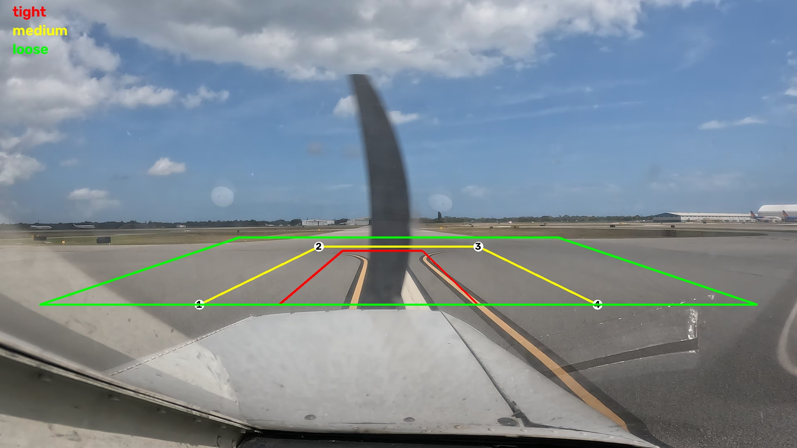
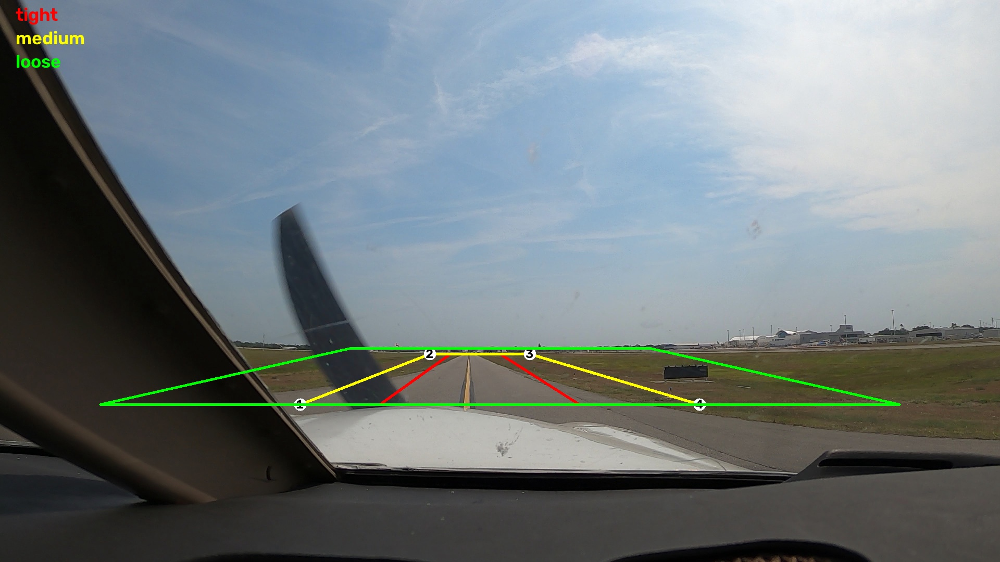
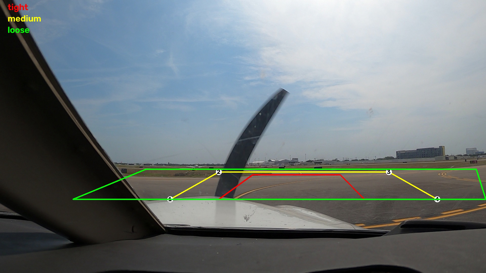
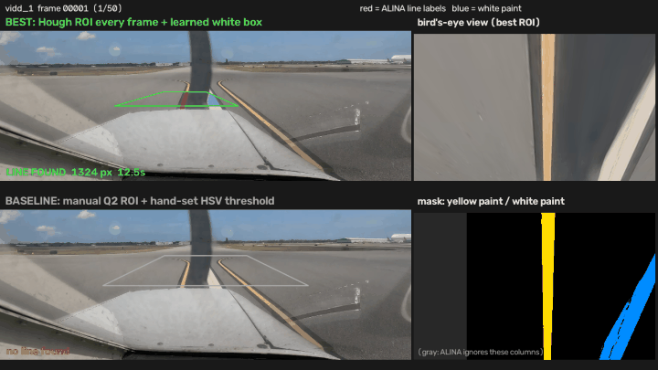

# ALINA

ALINA (Advanced Line Identification and Notation Algorithm) auto-labels taxiway centerline pixels in airport taxiway video frames using classical computer vision. Paper: [arXiv 2406.08775](https://arxiv.org/abs/2406.08775) (CVPR 2024 Workshop).

## Start here

| Step | Document | What it covers |
| --- | --- | --- |
| 1 | [ALINA Background](ALINA_README.md) | The original upstream project README (renamed from `README.md`): what's in the repo, CLI commands, benchmark results, references |
| 2 | [Background Q&A](BACKGROUND.md) | Questions and answers about ALINA: input folders, CBEM, Canny outputs, CIRCLEDAT, HSV vs RGB, preparation, ML/CV concepts, validation data |
| 3 | [uv environment setup](UV_ENV_SETUP.md) | Installing uv on macOS (Homebrew) and Windows, running the project, and how uv compares to pip, conda, Poetry, and Pipenv |

`ALINA_README.md` is the original upstream README, renamed so this file can serve as the entry point.

## Paper

| Resource | Link |
| --- | --- |
| arXiv abstract | [arxiv.org/abs/2406.08775](https://arxiv.org/abs/2406.08775) |
| PDF (v2) | [arxiv.org/pdf/2406.08775v2](https://arxiv.org/pdf/2406.08775v2) |
| Project website | [khanhafeez.github.io/alina-project-page](https://khanhafeez.github.io/alina-project-page/) |
| Code repository | [github.com/hafeezkhan909/ALINA](https://github.com/hafeezkhan909/ALINA) |

Citation: Khan, M. A. H., Ganeriwala, P., Bhattacharyya, S., Neogi, N., & Muthalagu, R. (2024). ALINA: Advanced Line Identification and Notation Algorithm. CVPR 2024 Workshops (CVPRW), pp. 7293-7302.

## Quick start

After installing uv (see [UV_ENV_SETUP.md](UV_ENV_SETUP.md)):

```bash
uv python pin 3.11
uv sync
uv run alina --help
```

## Assignment 4

The assignment brief is [Assgn_4_Fall_26.pdf](Assgn_4_Fall_26.pdf) ("Assignment 4: Exploration with AI/ML Engineering", 100 points). Each question below has a short summary and the commands to run. The detailed execution record and analysis for each question is in its own file under [`assignment/`](assignment/).

| Question | Topic | Points | Details |
| --- | --- | --- | --- |
| [Q1](#q1-getting-set-up) | Getting set up | 5 | [Q1_SETUP.md](assignment/Q1_SETUP.md) |
| [Q2](#q2-run-alina-with-a-manual-roi) | Run ALINA with a manual ROI | 5 | [Q2_MANUAL_ROI.md](assignment/Q2_MANUAL_ROI.md), [Q2Summary.md](assignment/Q2Summary.md) |
| [Q3](#q3-automating-roi-selection) | Automating ROI selection | 25 | [Q3_AUTO_ROI.md](assignment/Q3_AUTO_ROI.md), [data_used_in_q3.md](assignment/data_used_in_q3.md), [Q3_Q4_Summary.md](assignment/Q3_Q4_Summary.md) |
| [Q4](#q4-ml-based-color-thresholding) | ML-based color thresholding | 20 | [Q4_COLOR_THRESHOLD.md](assignment/Q4_COLOR_THRESHOLD.md), [Q3_Q4_Summary.md](assignment/Q3_Q4_Summary.md) |
| [Evaluation rigor](#evaluation-rigor) | Q3a, Q3b, and Q4: creativity and rigor (at least 5 methods) | 25 | [EVALUATION.md](assignment/EVALUATION.md) |
| [Report](#report) | Report | 20 | [REPORT.md](assignment/REPORT.md) |
| [Submission](#submission-checklist) | GitHub README, reproducibility, evidence | – | – |

### Q1. Getting set up

**Q1a. Read the ALINA paper.** Paper: [arXiv 2406.08775](https://arxiv.org/abs/2406.08775). Summary and Q&A: [BACKGROUND.md](BACKGROUND.md).

**Q1b. Fork the ALINA repository and set it up locally (5 points).** Fork: [github.com/hatemphd/ALINA](https://github.com/hatemphd/ALINA) (forked from [hafeezkhan909/ALINA](https://github.com/hafeezkhan909/ALINA)).

```bash
git clone https://github.com/hatemphd/ALINA.git ~/ALINA
cd ~/ALINA
brew install uv                 # macOS; Windows: see UV_ENV_SETUP.md
uv python pin 3.11
uv sync
uv run alina --help
uv run alina evaluate \
  --canny-dirs data/gt_alina_labels/canny_textfiles/canny_textfiles_1 data/gt_alina_labels/canny_textfiles/canny_textfiles_2 data/gt_alina_labels/canny_textfiles/canny_textfiles_3 \
  --alina-dirs data/gt_alina_labels/ALINA_textfiles/ALINA_textfiles_1 data/gt_alina_labels/ALINA_textfiles/ALINA_textfiles_2 data/gt_alina_labels/ALINA_textfiles/ALINA_textfiles_3
```

**Summary:** done. The fork is cloned to `~/ALINA` and set up with uv 0.9.26 on macOS 15.7.4 (Intel), Python 3.12.12, OpenCV 5.0.0. `alina --help` lists all 7 subcommands. `alina evaluate` gives **98.44% recall** (paper: 98.45%), 92.29% precision and 95.17% F1, which reproduces the paper's detection rate.

Details: [assignment/Q1_SETUP.md](assignment/Q1_SETUP.md)

### Q2. Run ALINA with a manual ROI

**Provide the ROI manually on the first frame of each video folder, and try different ROI sizes to see how the region is warped into a bird's-eye view (5 points).**

You will run 9 labeling runs: 3 videos × 3 ROI sizes (`tight`, `medium`, `loose`). Each run opens a window where you draw the ROI by hand on the first frame.

> **Assumptions:** these instructions are for **macOS** (zsh in Terminal, Cmd+Shift+4 screenshots). The repo is cloned into your **home directory** as `~/ALINA` (`/Users/<you>/ALINA`). If you cloned it somewhere else, replace `~/ALINA` with your path. (macOS folder names usually ignore case, so `~/alina` also works.)

**Step 0. Prerequisites**

- Open Terminal and go to the repo: `cd ~/ALINA`. Run every command below from there, in a normal desktop session. The ROI windows don't open over SSH or headless.
- The environment is set up (`uv sync`; see [Q1](#q1-getting-set-up)).
- **One-time: allow screenshots from Terminal.** Step 2 uses `screencapture`, which needs screen-recording permission:
  1. Run `open "x-apple.systempreferences:com.apple.preference.security?Privacy_ScreenCapture"`. This opens System Settings > Privacy & Security > Screen & System Audio Recording.
  2. Turn on **Terminal**, or **Cursor** if you run commands in Cursor's terminal. If it isn't listed, click **+** and add it (Terminal is in Applications > Utilities).
  3. Quit that app with Cmd+Q and reopen it so the permission takes effect.
- All Q2 outputs go into **`results/q2/`**, which is tracked by git so they can be pushed to GitHub. Only the resized `vidd_1` frames from Step 1 go into `outputs/`, which is git-ignored, because they can be regenerated. The full set of runs is about 180 MB.

Each run gets its own folder:

```
results/q2/<video>/<size>/
├── roi_confirm.png   # screenshot of the trapezoid you drew (Step 2)
├── annotated/        # 50 frames with the detected line in red
├── coords/           # 50 .txt files, one "x y" per detected pixel (empty = no line)
└── timing.log        # per-frame status and the summary line
```

**Step 1. Resize `vidd_1` to 1080p (recommended)**

`vidd_1` is 4K (3840×2160), but its ground truth (`canny_textfiles_1`) and the pipeline's pixel-based defaults are at 1920×1080, the size of `vidd_2` and `vidd_3`. Resizing puts all three videos on the same scale as the ground truth and cuts processing from about 3.6 to about 1.3 seconds per frame, because the extra 4K detail is discarded by the warp anyway.

```bash
uv run alina resize-images --input-dir data/Raw_Data/vidd_1 --output-dir outputs/vidd_1_1080p --width 1920 --height 1080
```

In the commands below, use `outputs/vidd_1_1080p` as the input folder for `vidd_1`. Say in your write-up that you resized it.

**Step 2. Know how to draw the ROI**

1. Click the 4 corners in this order: **Bottom-Left, Top-Left, Top-Right, Bottom-Right**.
2. Press any key in the `Polyline` window to lock the shape.
3. A `Confirm ROI` window shows the trapezoid. **Capture it before pressing a key.** The CLI doesn't save the ROI corners, so this screenshot is your only record of them. In a **second Terminal tab** (Cmd+T), run the command below, then click the `Confirm ROI` window:

   ```bash
   cd ~/ALINA && screencapture -o -iW results/q2/$VIDEO/$SIZE/roi_confirm.png
   ```

   Set `VIDEO` and `SIZE` in that tab too. This needs the screen-recording permission from Step 0. Alternatively, press Cmd+Shift+4, then Space, click the window, and move the file from the Desktop into the run folder as `roi_confirm.png`.
4. Back in the `Confirm ROI` window, press any key to start labeling. If the shape is wrong, press Ctrl+C in the first tab and re-run.

Rules for a good ROI:

- **Pavement only.** The bottom of every frame is the aircraft's nose and dashboard, so put the bottom edge **just above the nose**, not at the bottom of the frame. Put the top edge just below the horizon.
- **Keep the centerline in the centre or right part of the ROI.** The code zeroes the left 300 columns of the warped image (about the left 22% of the ROI), so a line near the ROI's left edge is ignored.
- **Top and bottom edges are forced horizontal.** The top-right corner takes the top-left's height, and the bottom-right takes the bottom-left's.

Guides showing the three target sizes on each video's first frame (red = `tight`, yellow = `medium` with the click order 1–4, green = `loose`):

| `vidd_1` | `vidd_2` | `vidd_3` |
| --- | --- | --- |
|  |  |  |

The same targets as percentages of the frame (x across from the left, y down from the top). The bottom edge is the line of corners 1 and 4; the top edge is corners 2 and 3:

| Video | Size | Bottom edge: y, x from–to | Top edge: y, x from–to |
| --- | --- | --- | --- |
| `vidd_1` | `tight` | 68%, 35%–60% | 56%, 43%–53% |
| `vidd_1` | `medium` | 68%, 25%–75% | 55%, 40%–60% |
| `vidd_1` | `loose` | 68%, 5%–95% | 53%, 30%–70% |
| `vidd_2` | `tight` | 72%, 38%–58% | 63%, 45%–50% |
| `vidd_2` | `medium` | 72%, 30%–70% | 63%, 43%–53% |
| `vidd_2` | `loose` | 72%, 10%–90% | 62%, 35%–65% |
| `vidd_3` | `tight` | 73%, 45%–75% | 64%, 52%–70% |
| `vidd_3` | `medium` | 73%, 35%–90% | 63%, 45%–80% |
| `vidd_3` | `loose` | 73%, 15%–100% | 62%, 30%–98% |

In `vidd_3` the centerline curves to the right, so its ROIs sit right of centre. Open a guide image next to the ROI window while you click.

The guides are drawn by [`scripts/q2_make_roi_guides.py`](scripts/q2_make_roi_guides.py), which holds the same percentages as this table. Regenerate them (after Step 1) with:

```bash
uv run python scripts/q2_make_roi_guides.py
```

**Step 3. Run the 9 labeling runs**

**Headless option (used for the recorded results):** [`scripts/q2_run_headless.py`](scripts/q2_run_headless.py) feeds the Step 2 trapezoids straight into the `alina` pipeline, so no clicking is needed. It runs all 9 combinations plus the Step 4 re-runs, and saves the exact corners (`roi.json`), the ROI overlay, the bird's-eye warp, the mask and a side-by-side `compare.jpg` in each run folder.

- **What it is:** the same run as `alina label`, without the GUI. The ROI is still a hand-chosen trapezoid, written in code instead of clicked, and labeling uses ALINA's unchanged `process_image()`. It does not choose the ROI automatically; that is Q3.
- **Why it was necessary:** the runs are extensive and slow. ALINA's pure-Python CIRCLEDAT takes from about 50 ms to over 30 s per frame. Across Q2–Q4 there were 77 runs, 3,850 labeled frames and about 13.6 hours of summed pipeline time (Q2 20 min, Q3 2.5 h, Q4 10.8 h).
  - **Interactively:** someone would have had to click and confirm each run and then wait, with no batching or parallel runs.
  - **Re-clicking:** it would shift the ROI by a few pixels each time, and Q2 shows that can swing a video from 47/50 to 0/50 frames.
  - **Headless:** runs are exactly repeatable (corners saved in `roi.json`) and run unattended in the background. The same approach powers the Q3 and Q4 runners.

  Details: [How the runs were executed](assignment/Q2_MANUAL_ROI.md#how-the-runs-were-executed).

```bash
MPLCONFIGDIR=/tmp/mpl uv run --frozen python scripts/q2_run_headless.py                # all runs
MPLCONFIGDIR=/tmp/mpl uv run --frozen python scripts/q2_run_headless.py vidd_2/medium  # one run
```

**Guided option:** [`scripts/q2_run_all.sh`](scripts/q2_run_all.sh) walks you through all 9 runs in one Terminal tab. For each run it opens the guide image, starts `alina label`, takes the `roi_confirm.png` screenshot when you press Enter, waits for labeling, checks the outputs, and pauses with "Ready for next". You can stop with Ctrl+C at any pause and resume later at a given run number:

```bash
bash scripts/q2_run_all.sh        # start at run 1
bash scripts/q2_run_all.sh 4      # resume at run 4 (vidd_2 tight)
```

**Manual option:** run the blocks below yourself. Each run is the same command; only the first line (`VIDEO`, `INPUT`, `SIZE`) changes. Run one block at a time, draw the ROI for that size (Step 2), capture `roi_confirm.png`, and wait for `Done: …` before the next block.

The first line sets `VIDEO` and `SIZE`, so set the same two values in the second tab before running `screencapture`.

**`vidd_1`** (input is the resized folder from Step 1, `outputs/vidd_1_1080p`):

```bash
VIDEO=vidd_1; INPUT=outputs/vidd_1_1080p; SIZE=tight
mkdir -p results/q2/$VIDEO/$SIZE
uv run alina label --input-dir $INPUT \
  --output-images-dir results/q2/$VIDEO/$SIZE/annotated \
  --output-coords-dir results/q2/$VIDEO/$SIZE/coords \
  --log-file results/q2/$VIDEO/$SIZE/timing.log
```

```bash
VIDEO=vidd_1; INPUT=outputs/vidd_1_1080p; SIZE=medium
mkdir -p results/q2/$VIDEO/$SIZE
uv run alina label --input-dir $INPUT \
  --output-images-dir results/q2/$VIDEO/$SIZE/annotated \
  --output-coords-dir results/q2/$VIDEO/$SIZE/coords \
  --log-file results/q2/$VIDEO/$SIZE/timing.log
```

```bash
VIDEO=vidd_1; INPUT=outputs/vidd_1_1080p; SIZE=loose
mkdir -p results/q2/$VIDEO/$SIZE
uv run alina label --input-dir $INPUT \
  --output-images-dir results/q2/$VIDEO/$SIZE/annotated \
  --output-coords-dir results/q2/$VIDEO/$SIZE/coords \
  --log-file results/q2/$VIDEO/$SIZE/timing.log
```

**`vidd_2`** (input is the original 1080p frames):

```bash
VIDEO=vidd_2; INPUT=data/Raw_Data/vidd_2; SIZE=tight
mkdir -p results/q2/$VIDEO/$SIZE
uv run alina label --input-dir $INPUT \
  --output-images-dir results/q2/$VIDEO/$SIZE/annotated \
  --output-coords-dir results/q2/$VIDEO/$SIZE/coords \
  --log-file results/q2/$VIDEO/$SIZE/timing.log
```

```bash
VIDEO=vidd_2; INPUT=data/Raw_Data/vidd_2; SIZE=medium
mkdir -p results/q2/$VIDEO/$SIZE
uv run alina label --input-dir $INPUT \
  --output-images-dir results/q2/$VIDEO/$SIZE/annotated \
  --output-coords-dir results/q2/$VIDEO/$SIZE/coords \
  --log-file results/q2/$VIDEO/$SIZE/timing.log
```

```bash
VIDEO=vidd_2; INPUT=data/Raw_Data/vidd_2; SIZE=loose
mkdir -p results/q2/$VIDEO/$SIZE
uv run alina label --input-dir $INPUT \
  --output-images-dir results/q2/$VIDEO/$SIZE/annotated \
  --output-coords-dir results/q2/$VIDEO/$SIZE/coords \
  --log-file results/q2/$VIDEO/$SIZE/timing.log
```

**`vidd_3`** (input is the original 1080p frames; default thresholds, see Step 4 for the re-run):

```bash
VIDEO=vidd_3; INPUT=data/Raw_Data/vidd_3; SIZE=tight
mkdir -p results/q2/$VIDEO/$SIZE
uv run alina label --input-dir $INPUT \
  --output-images-dir results/q2/$VIDEO/$SIZE/annotated \
  --output-coords-dir results/q2/$VIDEO/$SIZE/coords \
  --log-file results/q2/$VIDEO/$SIZE/timing.log
```

```bash
VIDEO=vidd_3; INPUT=data/Raw_Data/vidd_3; SIZE=medium
mkdir -p results/q2/$VIDEO/$SIZE
uv run alina label --input-dir $INPUT \
  --output-images-dir results/q2/$VIDEO/$SIZE/annotated \
  --output-coords-dir results/q2/$VIDEO/$SIZE/coords \
  --log-file results/q2/$VIDEO/$SIZE/timing.log
```

```bash
VIDEO=vidd_3; INPUT=data/Raw_Data/vidd_3; SIZE=loose
mkdir -p results/q2/$VIDEO/$SIZE
uv run alina label --input-dir $INPUT \
  --output-images-dir results/q2/$VIDEO/$SIZE/annotated \
  --output-coords-dir results/q2/$VIDEO/$SIZE/coords \
  --log-file results/q2/$VIDEO/$SIZE/timing.log
```

**Step 4. `vidd_3` with a lower saturation floor**

With the default color thresholds, `vidd_3` usually logs `[No lines found]` on every frame, because its paint looks washed out. That is a valid finding, so keep those runs. Then re-run the `medium` ROI with the saturation floor lowered from 70 to 40:

```bash
VIDEO=vidd_3; SIZE=medium_s40
mkdir -p results/q2/$VIDEO/$SIZE
uv run alina label --input-dir data/Raw_Data/vidd_3 \
  --output-images-dir results/q2/$VIDEO/$SIZE/annotated \
  --output-coords-dir results/q2/$VIDEO/$SIZE/coords \
  --log-file results/q2/$VIDEO/$SIZE/timing.log \
  --yellow-lower 0 40 170
```

Capture `roi_confirm.png` for this run as well (Step 2). If it still finds nothing, use `SIZE=medium_loose_thresh` and add `--yellow-lower 0 40 150 --mask-ignore-left-columns 100 --min-white-pixels 50 --peak-threshold 20`.

**Step 5. Collect the results**

```bash
# Summary line of each run: "Done: X/50 labeled, avg N ms/frame (F fps)"
for f in results/q2/*/*/timing.log; do echo "$f: $(tail -n 1 "$f")"; done

# Check that every run has its ROI screenshot and outputs
for d in results/q2/*/*/; do
  echo "$d  roi:$([ -f $d/roi_confirm.png ] || [ -f $d/roi.json ] && echo yes || echo MISSING)  frames:$(ls $d/annotated 2>/dev/null | wc -l | tr -d ' ')  coords:$(ls $d/coords 2>/dev/null | wc -l | tr -d ' ')"
done
```

For the write-up, copy 2–3 telling frames per video into `results/q2/highlights/`: a clean detection, a missed line, and extra red clutter if any. Use names like `vidd_2_tight_00001.jpg`.

**Step 6. Record and commit what you produced**

1. Fill in the tracking table in [Q2_MANUAL_ROI.md](assignment/Q2_MANUAL_ROI.md#run-tracking): screenshot path, approximate corners, and the log summary for each run.
2. Commit the results:

```bash
git add results/q2 assignment/Q2_MANUAL_ROI.md
git status        # review what will be committed
git commit -m "Q2: manual ROI runs (3 videos x 3 sizes)"
```

When you're done there should be 10 run folders (9 plus the `vidd_3` re-run), each with a `roi_confirm.png`. Then you're ready for the analysis in [Q2_MANUAL_ROI.md](assignment/Q2_MANUAL_ROI.md).

**Summary:** 11 runs were completed with the headless runner. Frames labeled out of 50:

| Video | Tight | Medium | Loose | Notes |
|---|---|---|---|---|
| `vidd_1` | 47 | 28 | 46 | Slow: 2–5 s per frame |
| `vidd_2` | 37 | 38 | 0 | Medium is the cleanest; in loose, the line is squeezed thin |
| `vidd_3` | 0 | 0 | 0 | Medium with S ≥ 40: 0. Medium with loose thresholds: 46, plus a false horizontal band, at about 12 s per frame |

The ROI size changes how wide and how slanted the line looks after the warp. A thin, slanted or curved line fails the column-histogram test even when the mask contains it. Full tables, corners, images and analysis: [Q2_MANUAL_ROI.md](assignment/Q2_MANUAL_ROI.md#execution-log). Short conclusion: [Q2Summary.md](assignment/Q2Summary.md).

Details: [assignment/Q2_MANUAL_ROI.md](assignment/Q2_MANUAL_ROI.md)

### Q3. Automating ROI selection

**Q3a. Explore ML techniques (for example multimodal LLMs or VLMs) to automate ROI selection on the first frame (20 points).**

**Q3b. Apply the automated approach to every frame instead of only the first, and compare ROI selection between frames. Does it improve performance? (5 points)**

**Prerequisites:** README Q2 Step 1 (`outputs/vidd_1_1080p`) and the Q2 medium runs (the manual baseline). The extra packages (`openai`, `scikit-learn`) are in uv's dev group, which `uv sync` installs.

#### Providing the OpenAI API key (GPT methods M3 and M4 only)

M1, M2 and M5, all of Q4, and re-scoring need **no key**. The GPT replies used in the results are cached in `results/q3/proposals/`, so re-running the GPT methods on the same frames makes no API calls and needs no key. A key is needed only to make *new* GPT calls: frames without a cached reply, a different model, or a fresh experiment.

1. Create a key at [platform.openai.com/api-keys](https://platform.openai.com/api-keys). The project needs access to the `gpt-5.5` model and some credit; the full every-frame run is about 300 calls.
2. Provide it in either of these ways:

   ```bash
   # Option A (recommended): a .env file in the repo root, read automatically by experiments/roi_methods/vlm.py
   cd ~/ALINA
   cp .env.example .env
   # edit .env and set: OPENAI_API_KEY=sk-proj-...

   # Option B: an environment variable for the current shell (takes precedence over .env)
   export OPENAI_API_KEY=sk-proj-...
   ```

3. Optional: choose a different vision model with `Q3_VLM_MODEL=<model>`, in `.env` or exported. The default is `gpt-5.5`.

**Keep the key secret.**
- `.env` is git-ignored (check with `git check-ignore .env`), and only the placeholder `.env.example` is committed.
- The code never prints or logs the key. Never paste it into code, notebooks or issues.
- If the account runs out of credit, the failed frames are not cached. Adding credit and re-running the same command fills in only those frames.

**Five methods**, all in [`experiments/roi_methods/`](experiments/roi_methods/): M1 Hough (classical baseline), M2 K-means paint clustering (unsupervised), M3 GPT-5.5 draws the corners, M4 GPT-5.5 marks the centerline, M5 Ridge regression (supervised, leave-one-video-out). Every method except M3 uses one shared trapezoid builder that makes the centerline vertical in the bird's-eye view ([design](assignment/Q3_AUTO_ROI.md#design)).

```bash
cd ~/ALINA
# Q3a + Q3b: propose ROIs (cached in results/q3/proposals/), then run ALINA unchanged
MPLCONFIGDIR=/tmp/mpl uv run python -m experiments.q3_auto_roi --modes first-frame every-frame
# a subset, e.g. one method on one video
MPLCONFIGDIR=/tmp/mpl uv run python -m experiments.q3_auto_roi --methods m4_vlm_points --videos vidd_2 --modes first-frame
# score everything (plus the Q2 manual baseline) -> results/q3/summary.csv
uv run python -m experiments.q3_score
```

Runtime on this Mac: about 16 minutes for the first-frame runs and about an hour for every-frame, mostly ALINA's line tracing on `vidd_1`. The every-frame mode makes about 300 GPT-5.5 calls; cached replies make re-runs free.

**Summary:** the automated ROI matches or beats the hand-drawn Q2 ROI on every video. Results come from `results/q3/summary.csv`. CBEM F1 is accuracy against the 17 ground-truth frames; `vidd_3` has none, so it shows frames labeled.

| Video | Manual ROI (Q2) | Best automated, first frame (Q3a) | Same method, every frame (Q3b) |
|---|---|---|---|
| `vidd_1` | CBEM F1 23.8 | M1 Hough: **70.0** | 71.5 |
| `vidd_2` | CBEM F1 91.6 | M4 GPT-5.5 centerline points: **91.3** | 91.0 |
| `vidd_3` | 0/50 labeled | M1 Hough: **16/50** | 22/50 |

- **Q3a:** the gain comes from the shared trapezoid. It makes the centerline vertical in the bird's-eye view, the main lesson from Q2. Asking GPT-5.5 to point at the line works much better than asking it to draw the box (CBEM F1 64.2 vs 13.2 on `vidd_1`).
- **Q3b:** a new ROI on every frame helps when the first ROI was wrong or the taxiway curves (`vidd_3`: 0–16 → 13–26 frames labeled). It doesn't help a good ROI on a straight taxiway (`vidd_2`: within about 1 point). It costs one ROI proposal per frame, which for GPT is a paid call taking 15–36 s.
- **GPT re-run:** the OpenAI credits ran out during the first Q3b pass (146 of 300 calls failed). After adding credits, re-running the same command filled in only those frames, so the GPT every-frame results now cover all 50 frames per video.

Details: [assignment/Q3_AUTO_ROI.md](assignment/Q3_AUTO_ROI.md) | Data sources: [assignment/data_used_in_q3.md](assignment/data_used_in_q3.md)

### Q4. ML-based color thresholding

**Explore ML techniques to find the color thresholds for line markings (yellow and white taxiway lines), replacing the current hand-set HSV thresholds (20 points).** Current baseline: HSV `(0, 70, 170)` to `(255, 255, 255)` (see [HSV vs RGB](BACKGROUND.md#hsv-vs-rgb)).

Prerequisites: Q1 setup and the dev dependencies (`uv sync`; uses `scikit-learn`, no API key). The color step is swapped in `experiments/color_methods/`; `alina/` is unchanged. Every method uses the same fixed ROI per video (the Q3a Hough ROI), so only the color step varies.

| # | Method | Type |
|---|---|---|
| 0 | Hand-set HSV range | Baseline |
| 1 | Otsu per frame on S and V | Unsupervised |
| 2 | Gaussian mixture per frame in Lab | Clustering |
| 3 | Decision tree → explicit HSV boxes | Supervised |
| 4 | Logistic regression on HSV + Lab | Supervised, linear |
| 5 | MLP on pixel + neighborhood features | Neural network |

```bash
uv run python -m experiments.q4_color_threshold      # all methods x videos, yellow-only and yellow+white (~80 min on 12 CPUs)
uv run python -m experiments.q4_color_threshold --methods m3_tree --videos vidd_2 --use yellow   # one run
uv run python -m experiments.q4_score                # results/q4/summary.csv and pixels.csv
uv run python -m experiments.q4_figures              # results/q4/figures/
```

Labels: yellow training labels come from the published ALINA labels, and the test labels from CBEM. White paint occurs only in `vidd_1`, so I traced it by hand the CBEM way. Supervised methods are trained leave-one-video-out, seed 42.

**Summary:**

| Method | Yellow mask F1 | White mask F1 | CBEM F1 `vidd_1` / `vidd_2` | `vidd_3` frames labeled |
|---|---|---|---|---|
| Baseline | 0.884 | 0 | 70.0 / 83.2 | 16 |
| Otsu | 0.883 | 0.703 | 66.2 / 80.8 | 2 |
| GMM | 0.814 | 0.931 | 66.0 / 67.5 | 19 |
| Tree | 0.901 | 0.960 | 67.6 / 54.6 | 35 |
| LogReg | 0.796 | 0.764 | 22.1 / 80.2 | 35 |
| **MLP** | **0.907** | **0.983** | 67.0 / 81.9 | 18 |

- **Best masks: the MLP.** It is best for yellow and white, with 0.01% false white. It is the only method that uses neighborhood context.
- **End-to-end, the hand-set yellow range is still as good or better** on the two videos with ground truth. A better mask isn't always a better label: the tree marks the aircraft nose as yellow on `vidd_2`, and ALINA's traversal pulls it in.
- **White:** the baseline can't detect it at all. The tree learns an explicit white box, low saturation (S ≤ ~66) and high brightness (V ≥ ~200), and adds it to ALINA without hurting yellow.
- **Lighting shift:** logistic regression trained on overcast videos calls the pale sunlit yellow of `vidd_1` "white". The tree and logistic regression lower the brightness bound and label 35/50 `vidd_3` frames, against 16 for the baseline.

Details: [assignment/Q4_COLOR_THRESHOLD.md](assignment/Q4_COLOR_THRESHOLD.md)

### Q3 and Q4 Summary

**Q3 automated where to look (the ROI); Q4 automated what counts as paint (the color threshold).**
- **Q3:** a cheap Hough-line method, combined with Q2's lesson to keep the line big and vertical, beat the hand-drawn ROI. `vidd_1` went from 23.8 to 70.0 CBEM F1, and `vidd_3` from 0 to 16–22 labeled frames. GPT-5.5 helped only when asked to point at the line.
- **Q4:** learned thresholds made better masks and added white-line detection (white F1 0.98, against 0 for the baseline). They didn't beat the hand-set yellow rule end to end where it already worked; one wrong blob such as the aircraft nose costs more than a slightly better mask gains.

**Final takeaway:** the ROI matters most, and simple ideas used well beat heavy models. The evidence is limited by the small ground truth (17 frames, none for `vidd_3`).

Full conclusion: [assignment/Q3_Q4_Summary.md](assignment/Q3_Q4_Summary.md)

### Evaluation rigor

**Q3a, Q3b, and Q4 are graded on creativity (state-of-the-art techniques or your own approach) and on rigor: test at least 5 methods and report tables using ALINA's metrics, adding more metrics if needed (25 points).**

```bash
# Score a method's coordinate output against the CBEM ground truth (directories are paired by position)
uv run alina evaluate \
  --canny-dirs data/gt_alina_labels/canny_textfiles/canny_textfiles_1 \
  --alina-dirs outputs/<experiment>/coords
```

```bash
# cross-question plots (after q3_score and q4_score) -> results/summary/
uv run python -m experiments.summary_plots
```

**Summary:** best method per question. CBEM F1 is ALINA's metric against ground truth (%); `vidd_3` has no ground truth, so frames labeled out of 50 are shown.

| Question | Best method | `vidd_1` CBEM F1 | `vidd_2` CBEM F1 | `vidd_3` frames labeled |
|---|---|---|---|---|
| Q2 manual ROI | Medium ROI | 23.8 | **91.6** | 0 |
| Q3a first-frame ROI | M1 Hough (`vidd_1`, `vidd_3`), M4 GPT points (`vidd_2`) | **70.0** | 91.3 | 16 |
| Q3b every-frame ROI | M1 Hough | **71.5** | 82.8 | **22** |
| Q4 color step | MLP (best masks), tree (explicit thresholds); baseline still best end-to-end on yellow | 70.0 (baseline), 67.0 (MLP) | 83.2 (baseline), 81.9 (MLP) | **35** (tree) |

Seed 42 is used everywhere; GPT replies are cached for exact reproduction. Each method was run once per video: everything except the GPT methods is deterministic, and the GPT methods were not repeated to measure run-to-run variation (each repeat costs about 300 paid calls).

Details: [assignment/EVALUATION.md](assignment/EVALUATION.md) (frames used, all metrics, seeds, plots)

### Report

**Submit a report that covers the following (20 points):**

**Full report: [assignment/REPORT.md](assignment/REPORT.md)**. It covers the abstract, the designed pipeline, experiments, results with tables and figures, limitations, and conclusions. The short version follows.

1. **Designed ML pipeline.** ALINA itself (`alina/`) is unchanged. Two of its manual steps are replaced by pluggable ML components:
   - **ROI selection (Q3):** a method finds the ego centerline (Hough, K-means + RANSAC, GPT-5.5, or Ridge regression). A shared builder then turns it into a shallow trapezoid that makes the line vertical in the bird's-eye view, the lesson from Q2. A sanity check replaces unusable ROIs with a centred fallback. It runs once on the first frame (Q3a) or on every frame (Q3b).
   - **Color threshold (Q4):** the `cv2.inRange` step is swapped for a function that returns yellow and white masks (Otsu, Gaussian mixture, decision tree, logistic regression or MLP). The rest of ALINA (left-column zeroing, histogram, CIRCLEDAT, unwarp) runs unchanged; with the baseline plugged in it reproduces ALINA's output pixel for pixel.
   - **Evaluation:** ALINA's metric against CBEM ground truth, plus agreement with the published labels, frames labeled, time, ROI stability, and pixel-level mask IoU/F1.

   Plain-English guide to every technique and why it was chosen: [ML_METHODS_EXPLAINED.md](assignment/ML_METHODS_EXPLAINED.md).

2. **Experiments performed.**
   - **Q2:** 11 manual-ROI runs (3 sizes × 3 videos, plus 2 threshold variants on `vidd_3`).
   - **Q3a:** 5 ROI methods × 3 videos.
   - **Q3b:** the same 5 methods with a new ROI on every frame.
   - **Q4:** 6 color methods (baseline + 5) × 3 videos × 2 modes (yellow only, yellow + white), with leave-one-video-out training.

   Every run covers all 50 frames per video; the scoring is in `results/q3/summary.csv` and `results/q4/summary.csv`.

3. **Results and discussion.** See the summary table above and [EVALUATION.md](assignment/EVALUATION.md).
   - **The ROI matters most.** Automating it with a line-centred trapezoid took `vidd_1` from 23.8 to 70.0 CBEM F1 and `vidd_3` from 0 to 16–22 frames. Classical Hough did best overall. GPT-5.5 did well only when asked to point at the line, not to draw the box.
   - **Per-frame ROI** helps curves and bad first ROIs, and does nothing for a good ROI on a straight taxiway.
   - **Learned color thresholds** give better masks and add white detection, which the baseline lacks (white F1 0.98 vs. 0). They raise `vidd_3` coverage to 35 frames, but don't beat the hand-set yellow range end-to-end on the two videos with ground truth. Because ALINA keeps everything connected to the line, one wrong blob, such as the aircraft nose, costs more than many scattered errors.

4. **Limitations.**
   - **Little ground truth:** only 17 CBEM frames (7 in `vidd_1` and 10 in `vidd_2`; none in `vidd_3`), and `vidd_1`'s 7 contain just 2 distinct tracings.
   - **Weak training labels:** the published labels used for training are the authors' ALINA output, not independent truth.
   - **Thin white evidence:** white labels come from one hand-traced stripe in one video.
   - **No repeated GPT runs:** each GPT method was run once (the calls that failed when the credits ran out were completed in a second pass), so run-to-run variance (mean ± std) wasn't measured.
   - **No CNN or segmentation foundation model:** PyTorch isn't available on this Intel Mac.
   - **Slow timing:** ALINA's Python CIRCLEDAT dominates time (seconds per frame), so speed comparisons mostly reflect mask size.

### Demo video

End-to-end demo of the best pipeline (Hough ROI on every frame + ALINA's yellow threshold + the learned white box) next to the original manual pipeline, on all three videos:

[](results/demo/alina_best_method.mp4)

- **Rendered clip:** [`results/demo/alina_best_method.mp4`](results/demo/alina_best_method.mp4) (1:33). Regenerate with `uv run python -m experiments.make_demo_video` (about 20 s, from saved results).
- **Narrated walkthrough:** *link to be added after recording*
- **Narration script, timeline and recording steps:** [assignment/DEMO_VIDEO.md](assignment/DEMO_VIDEO.md)
- **Building a video from the frame images yourself** (ffmpeg, Python or iMovie): [assignment/building_video.md](assignment/building_video.md)

### Saving the experiment data

**Full experiment data (Google Drive):** [ALINA results archive](https://drive.google.com/file/d/11wKV1DYAJMh3jUcTpf9Wxy_7zr9-00rW/view?usp=drive_link). Download it and restore it with `cd ~/ALINA && unzip -o ~/Downloads/ALINA_results_*.zip`.

The runs produce about 350 MB, mostly annotated frames. Keep a full copy on Google Drive as one zip; GitHub gets the summaries, logs, ROI evidence, plots, coords and cached GPT replies, about 83 MB. `.gitignore` already keeps the bulky folders (`results/q2|q3/**/annotated/`, `results/q4/train_cache/`), zips and `.env` out of git.

```bash
cd ~/ALINA && zip -r -q ~/Desktop/ALINA_results_$(date +%Y-%m-%d).zip results outputs -x "*.DS_Store"
```

Details, the restore command, and pre-commit checks: [assignment/saving_experiments_data.md](assignment/saving_experiments_data.md)

### Submission checklist

- [ ] GitHub repository link submitted (commit and push first; nothing is committed yet)
- [x] README explains how to run and reproduce every experiment (including how to provide the OpenAI key)
- [x] Random seeds fixed for all ML components (seed 42; GPT replies cached)
- [x] Metrics tables for at least 5 methods (Q3a, Q3b, Q4)
- [x] Plots and graphs (`results/summary/`, `results/q3/overlays/`, `results/q4/figures/`)
- [ ] Video demonstration of the end-to-end pipeline using the best method (clip rendered in `results/demo/`; narration and upload pending, see [DEMO_VIDEO.md](assignment/DEMO_VIDEO.md))
- [x] Report covering the four required sections

## Navigation

### This page

- [Start here](#start-here)
- [Paper](#paper)
- [Quick start](#quick-start)
- [Assignment 4](#assignment-4): [Q1](#q1-getting-set-up), [Q2](#q2-run-alina-with-a-manual-roi), [Q3](#q3-automating-roi-selection), [Q4](#q4-ml-based-color-thresholding), [Q3 and Q4 Summary](#q3-and-q4-summary), [Evaluation rigor](#evaluation-rigor), [Report](#report), [Demo video](#demo-video), [Saving the experiment data](#saving-the-experiment-data), [Submission checklist](#submission-checklist)
- [Code and data map](#code-and-data-map)

### Assignment details ([assignment/](assignment/))

| File | Covers |
| --- | --- |
| [Q1_SETUP.md](assignment/Q1_SETUP.md) | Paper takeaways, fork, environment, setup evidence |
| [Q2_MANUAL_ROI.md](assignment/Q2_MANUAL_ROI.md) | How the ROI works in the code, ROI sizes tested, results, analysis |
| [Q2Summary.md](assignment/Q2Summary.md) | Simple conclusion for Q2 |
| [Q3_Q4_Summary.md](assignment/Q3_Q4_Summary.md) | What was done in Q3 and Q4, conclusions, and the final takeaway |
| [REPORT.md](assignment/REPORT.md) | Final report: pipeline, experiments, results and discussion, limitations, conclusion |
| [DEMO_VIDEO.md](assignment/DEMO_VIDEO.md) | Demo video: what it shows, timeline, narration script, recording and upload steps |
| [building_video.md](assignment/building_video.md) | Turning a folder of labeled frames into an MP4 with ffmpeg, Python or iMovie |
| [Q3_Q4_Techniques_and_Results.pptx](Q3_Q4_Techniques_and_Results.pptx) | Slide deck (31 slides): the Q3 and Q4 ML techniques and their results. Rebuild with `uv run --with python-pptx python scripts/make_slides.py` |
| [ALINA_Explained.pptx](ALINA_Explained.pptx) | Slide deck (20 slides): what ALINA is, its pipeline, data, evaluation and limitations |
| [ML_review_ideation.md](assignment/ML_review_ideation.md) | Study guide to every ML technique (plain English, then details), how ALINA's F1 differs from textbook F1, and further ideas with a fast follow-up experiment |
| [github_vs_googledrive.md](assignment/github_vs_googledrive.md) | What is on GitHub and what stays local / on Google Drive (git-ignored files) |
| [Q3_AUTO_ROI.md](assignment/Q3_AUTO_ROI.md) | Integration point, Q3a methods and results, Q3b per-frame comparison |
| [data_used_in_q3.md](assignment/data_used_in_q3.md) | Which original ALINA data and Q2 outputs Q3 uses, and how |
| [Q4_COLOR_THRESHOLD.md](assignment/Q4_COLOR_THRESHOLD.md) | Baseline, training data, methods, results for yellow and white lines |
| [EVALUATION.md](assignment/EVALUATION.md) | Ground truth, frames used, metrics, reproducibility (seeds), best method per question, plots |
| [ML_METHODS_EXPLAINED.md](assignment/ML_METHODS_EXPLAINED.md) | Plain-English explanation of every ML technique, its purpose, and why it was chosen |
| [saving_experiments_data.md](assignment/saving_experiments_data.md) | Zipping all run data for Google Drive, restoring it, and what is kept out of GitHub |

### ALINA Background ([ALINA_README.md](ALINA_README.md))

| Section | Subsections |
| --- | --- |
| [What's in this Repo](ALINA_README.md#whats-in-this-repo) | |
| [Repository structure](ALINA_README.md#repository-structure) | |
| [Setup](ALINA_README.md#setup) | |
| [Running the pipeline](ALINA_README.md#running-the-pipeline) | [`alina label` (batch)](ALINA_README.md#alina-label-batch), [`alina label --image` (single frame)](ALINA_README.md#alina-label-image), [`alina video-to-frames`](ALINA_README.md#alina-video-to-frames), [`alina rotate-frames`](ALINA_README.md#alina-rotate-frames), [`alina resize-images`](ALINA_README.md#alina-resize-images), [`alina cbem`](ALINA_README.md#alina-cbem), [`alina evaluate`](ALINA_README.md#alina-evaluate), [`alina superimpose`](ALINA_README.md#alina-superimpose) |
| [Benchmark results](ALINA_README.md#benchmark-results) | |
| [References](ALINA_README.md#references) | |
| [Acknowledgement](ALINA_README.md#acknowledgement) | |

### Background Q&A ([BACKGROUND.md](BACKGROUND.md))

| Section | Subsections |
| --- | --- |
| [1. What is ALINA?](BACKGROUND.md#what-is-alina) | [Plain-English explanation](BACKGROUND.md#plain-english-explanation), [Value proposition and purpose](BACKGROUND.md#value-proposition), [Thought process](BACKGROUND.md#thought-process), [Key concepts and findings](BACKGROUND.md#key-concepts) |
| [2. Which input files are provided to ALINA?](BACKGROUND.md#input-files) | |
| [3. What is CBEM?](BACKGROUND.md#what-is-cbem) | |
| [4. What are Canny images?](BACKGROUND.md#canny-images) | |
| [5. What are Canny text files?](BACKGROUND.md#canny-text-files) | |
| [6. What does CIRCLEDAT do in ALINA?](BACKGROUND.md#circledat) | |
| [7. Why HSV instead of RGB?](BACKGROUND.md#hsv-vs-rgb) | |
| [8. What preparation is needed?](BACKGROUND.md#preparation) | |
| [9. Which ML and CV concepts were used?](BACKGROUND.md#ml-cv-concepts) | |
| [10. What is provided for validation?](BACKGROUND.md#validation) | [The two example images](BACKGROUND.md#example-images), [Validation data: `data/gt_alina_labels/`](BACKGROUND.md#validation-data), [What is not validation data](BACKGROUND.md#not-validation-data), [Gap: frames without raw images](BACKGROUND.md#validation-gap) |
| [11. Summary tables](BACKGROUND.md#summary-tables) | [Input, validation, and output data](BACKGROUND.md#input-validation-output-data), [ALINA's calculations vs standard ML formulas](BACKGROUND.md#alina-vs-ml-formulas) |

### uv environment setup ([UV_ENV_SETUP.md](UV_ENV_SETUP.md))

| Section | Subsections |
| --- | --- |
| [1. Install uv](UV_ENV_SETUP.md#install-uv) | [macOS (Homebrew)](UV_ENV_SETUP.md#macos-homebrew), [Windows](UV_ENV_SETUP.md#windows) |
| [2. Set up the project](UV_ENV_SETUP.md#set-up-the-project) | |
| [3. Run ALINA](UV_ENV_SETUP.md#run-alina) | [Check the evaluation](UV_ENV_SETUP.md#check-the-evaluation), [Label frames](UV_ENV_SETUP.md#label-frames), [Activate the environment the classic way](UV_ENV_SETUP.md#activate-the-environment), [Useful uv commands](UV_ENV_SETUP.md#useful-uv-commands) |
| [4. Why uv? Comparison with other options](UV_ENV_SETUP.md#why-uv) | [Why uv suits ALINA](UV_ENV_SETUP.md#why-uv-suits-alina), [When another tool might be better](UV_ENV_SETUP.md#when-another-tool) |
| [5. Troubleshooting](UV_ENV_SETUP.md#troubleshooting) | |
| [Verified](UV_ENV_SETUP.md#verified) | |

### Paper links

- [arXiv abstract](https://arxiv.org/abs/2406.08775) | [PDF (v2)](https://arxiv.org/pdf/2406.08775v2) | [Project website](https://khanhafeez.github.io/alina-project-page/) | [Code repository](https://github.com/hafeezkhan909/ALINA)

## Code and data map

### Code

| Path | Purpose |
| --- | --- |
| [`alina/config.py`](alina/config.py) | All tunable parameters |
| [`alina/roi.py`](alina/roi.py) | Interactive region-of-interest (ROI) selection |
| [`alina/color.py`](alina/color.py) | HSV color normalization |
| [`alina/histogram.py`](alina/histogram.py) | Vertical projection histogram and peak detection |
| [`alina/traversal.py`](alina/traversal.py) | CIRCLEDAT line traversal |
| [`alina/pipeline.py`](alina/pipeline.py) | Main labeling loop (`process_image`, `run_batch`) |
| [`alina/io_utils.py`](alina/io_utils.py) | Video to frames, rotate, resize |
| [`eval/metrics.py`](eval/metrics.py) | Precision, recall, and F1 |
| [`eval/cbem.py`](eval/cbem.py) | Create CBEM ground truth |
| [`eval/evaluate.py`](eval/evaluate.py) | Batch evaluation |
| [`eval/superimpose.py`](eval/superimpose.py) | Overlay coordinates on the Canny map |
| [`cli.py`](cli.py) | `alina` command entry point |
| [`pyproject.toml`](pyproject.toml) | Project metadata, dependencies, and the `alina` script |

### Data and assets

| Path | Contents |
| --- | --- |
| [`data/Raw_Data/`](data/Raw_Data/) | Raw taxiway video frames (`vidd_1` to `vidd_3`) |
| [`data/Labeled_Data/`](data/Labeled_Data/) | ALINA output per video: `annotations` (images) and `textfiles` (coordinates) |
| [`data/gt_alina_labels/`](data/gt_alina_labels/) | Validation data (ground truth and ALINA labels) |
| [`data/gt_alina_labels/canny_images/`](data/gt_alina_labels/canny_images/) | CBEM Canny edge images (`_1` to `_3`) |
| [`data/gt_alina_labels/canny_textfiles/`](data/gt_alina_labels/canny_textfiles/) | CBEM ground-truth coordinates (`_1` to `_3`) |
| [`data/gt_alina_labels/ALINA_textfiles/`](data/gt_alina_labels/ALINA_textfiles/) | ALINA label coordinates to evaluate (`_1` to `_3`) |
| [`assets/method.png`](assets/method.png) | Method overview figure |
