# Q2. Run ALINA with a manual ROI: execution and analysis

[Back to README](../README.md#q2-run-alina-with-a-manual-roi) | [Assignment brief](../Assgn_4_Fall_26.pdf)

This file holds the detailed record for Q2. The commands to run and the short summary live in the [README](../README.md#q2-run-alina-with-a-manual-roi).

**Task:** provide the ROI manually on the first frame of each video folder, and try different ROI sizes to understand how a region is warped into a bird's-eye view (5 points).

---

## How the ROI actually works in the code

Facts from [`alina/roi.py`](../alina/roi.py) and [`alina/pipeline.py`](../alina/pipeline.py) that affect this experiment:

- **Click order:** Bottom-Left, Top-Left, Top-Right, Bottom-Right, then press any key.
- **The trapezoid's top and bottom edges are forced horizontal.** `roi_points_to_quad` takes Top-Right's *y* from Top-Left, and Bottom-Right's *y* from Bottom-Left. Only the *x* of your 3rd and 4th clicks matters.
- **The warp target is a fixed rectangle**, from (50, 100) to (1200, 800), set in `ROIConfig` in [`alina/config.py`](../alina/config.py). Whatever ROI you draw is stretched into that same rectangle. A small ROI is magnified; a large ROI is squeezed.
- **The left 300 columns of the warped mask are always zeroed** (`--mask-ignore-left-columns 300`). A wide ROI can push a real line into that dead zone.
- **The warped bird's-eye image is not saved** by the pipeline. The headless runner below saves it (`birds_eye.jpg`, `mask.jpg`, `compare.jpg`).
- **`vidd_1` is 4K (3840×2160)**, while `vidd_2` and `vidd_3` are 1920×1080. The fixed warp rectangle was designed for roughly 1080p, so `vidd_1` was resized first (Step 1).

---

<a id="how-the-runs-were-executed"></a>

## How the runs were executed

Instead of clicking the corners by hand in the `Confirm ROI` window, the trapezoids were fed to the pipeline programmatically by [`scripts/q2_run_headless.py`](../scripts/q2_run_headless.py).

### What the headless runner is

`alina label` is interactive. It opens a window, waits for you to click four ROI corners, shows a `Confirm ROI` window, waits for a key press, and only then labels the frames. The headless runner performs the same run with no window and no person at the keyboard:

- **The ROI is still a human choice.** The corners are not computed: they are the tight/medium/loose trapezoids defined once in [`scripts/q2_make_roi_guides.py`](../scripts/q2_make_roi_guides.py), written down instead of clicked. Choosing the ROI automatically is Q3's job, not this script's.
- **The labeling is ALINA's own code.** It calls the unchanged `process_image()`, so the results are the same as clicking those corners in `alina label`.
- **It saves what the interactive tool doesn't:** the exact corners (`roi.json`), the ROI overlay, the bird's-eye warp, the mask, and a side-by-side `compare.jpg`.

### Why it was necessary: the runs are extensive and slow

ALINA's CIRCLEDAT traversal is a pure-Python flood fill, so a single frame takes from about 50 ms (no line found) to over 30 seconds (a large mask). Summing ALINA's own per-run totals from every `timing.log`:

| Question | Runs | Frames labeled | ALINA pipeline time, summed |
|---|---|---|---|
| Q2 | 11 | 550 | 1,199 s (20 min) |
| Q3 (first-frame and every-frame) | 30 | 1,500 | 8,990 s (2.5 h) |
| Q4 (6 methods × 3 videos × 2 modes) | 36 | 1,800 | 38,793 s (10.8 h) |
| **Total** | **77** | **3,850** | **about 13.6 h** |

The Q3 and Q4 times were measured with 6–10 runs in parallel, so each run is slower than it would be alone, but the scale is clear. Doing this interactively would have meant:

- **Someone at the screen for every run:** 77 sessions of clicking corners, confirming, then waiting minutes to hours for labeling, with no way to batch or parallelise runs that each block on a GUI window.
- **No exact repeat:** a hand click lands a few pixels off each time. Q2 showed that small ROI changes swing a video from 47/50 to 0/50 frames, so re-clicking would change the results. The headless runner reproduces the same corners every time and records them in `roi.json`.
- **No fair comparison later:** Q3 compares automated ROIs against the Q2 medium ROI, and Q4 holds one ROI fixed across all color methods. Both need the ROI as exact numbers, not a one-off click.

The same pattern, no GUI and ALINA's unchanged `process_image()` with programmatic inputs, is what made the Q3 (`experiments/q3_auto_roi.py`) and Q4 (`experiments/q4_color_threshold.py`) runners possible. They run in the background on several processes (Q3 also caches its GPT replies, so an interrupted run resumes without repeating calls), and the 13-plus hours of pipeline time ran unattended.

### Details

- The corners are the tight/medium/loose trapezoids defined in [`scripts/q2_make_roi_guides.py`](../scripts/q2_make_roi_guides.py) (the same shapes drawn in `results/q2/roi_guides/`), converted to pixels on the first frame of each folder.
- They are passed in the same `(1, 6, 2)` format that `select_roi` returns (`[BL, TL, TL, TR, TR, BR]`), then go through the unchanged `roi_points_to_quad` and `process_image` from the `alina` package.
- All other settings are the CLI defaults (`PipelineConfig()`), except where a run lists an override.
- Each run writes the same `annotated/`, `coords/` and `timing.log` as `alina label`, plus ROI evidence: `roi.json`, `roi_overlay.jpg`, `birds_eye.jpg`, `mask.jpg` and `compare.jpg`.

Command (run in `~/ALINA`; optional arguments such as `vidd_2/medium` run a subset):

```bash
MPLCONFIGDIR=/tmp/mpl uv run --frozen python scripts/q2_run_headless.py
```

The manual alternative (`alina label` plus `screencapture`, or the guided `scripts/q2_run_all.sh`) is still documented in the README.

---

<a id="execution-log"></a>

## Execution log

All steps were run on October 4, 2026, in `~/ALINA` (macOS 15.7.4, Intel, Python 3.12.12, opencv-python 5.0.0.93).

| Step | Command | Outcome | Evidence |
|---|---|---|---|
| 1. Resize `vidd_1` to 1080p | `uv run alina resize-images --input-dir data/Raw_Data/vidd_1 --output-dir outputs/vidd_1_1080p --width 1920 --height 1080` | `Resized 50 images to 1920x1080` | [`results/q2/evidence/step1_resize_vidd_1.png`](../results/q2/evidence/step1_resize_vidd_1.png) |
| 2. ROI guides | `uv run python scripts/q2_make_roi_guides.py` | 3 guide images | [`results/q2/roi_guides/`](../results/q2/roi_guides/) |
| 3. Nine ROI runs | `MPLCONFIGDIR=/tmp/mpl uv run --frozen python scripts/q2_run_headless.py` | 9 runs plus `medium_s40`, about 630 s total | `results/q2/<video>/<size>/timing.log` |
| 4a. `vidd_3` with S ≥ 40 | included in Step 3 (`vidd_3/medium_s40`) | 0/50 labeled | [`results/q2/vidd_3/medium_s40/`](../results/q2/vidd_3/medium_s40/) |
| 4b. `vidd_3` with looser thresholds | `... q2_run_headless.py vidd_3/medium_loose_thresh` | 46/50 labeled, 593 s | [`results/q2/vidd_3/medium_loose_thresh/`](../results/q2/vidd_3/medium_loose_thresh/) |

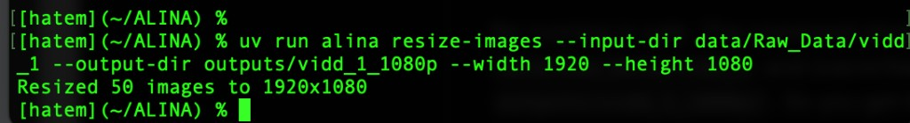

---

<a id="run-tracking"></a>

## Run tracking

Every Q2 run writes to its own folder, `results/q2/<video>/<size>/`, which is tracked by git:

| File | What it is | Created by |
|---|---|---|
| `roi.json` | Exact ROI corners, in pixels and as fractions of the frame | `q2_run_headless.py` |
| `roi_overlay.jpg` | The trapezoid drawn on frame 1 (replaces the `roi_confirm.png` screenshot of the manual method) | `q2_run_headless.py` |
| `birds_eye.jpg` | Frame 1 warped into the destination rectangle | `q2_run_headless.py` |
| `mask.jpg` | The HSV mask of the bird's-eye view, after zeroing the ignored left columns | `q2_run_headless.py` |
| `compare.jpg` | Camera + ROI, bird's-eye view, and mask side by side | `q2_run_headless.py` |
| `annotated/*.jpg` | Each frame with the detected line pixels in red | `process_image` |
| `coords/*.txt` | Detected line pixels, one `x y` per line; empty file = no line found | `process_image` |
| `timing.log` | Per-frame `[Labeled]` / `[No lines found]`, pixel count, time; summary line at the end | `q2_run_headless.py` (same format as `alina label --log-file`) |

Other files from this step:

| Path | What it is | Tracked by git? |
|---|---|---|
| `outputs/vidd_1_1080p/` | `vidd_1` frames resized from 4K to 1920×1080 (input for the `vidd_1` runs) | No (`outputs/` is ignored; regenerate with README Step 1) |
| `results/q2/evidence/` | Terminal screenshots proving each step was run (e.g. `step1_resize_vidd_1.png`) | Yes |
| `results/q2/roi_guides/vidd_{1,2,3}_guide.jpg` | Tight/medium/loose trapezoids drawn on each video's first frame. Generated by [`scripts/q2_make_roi_guides.py`](../scripts/q2_make_roi_guides.py) | Yes |
| `results/q2/highlights/` | Hand-picked frames for the write-up | Yes |

### Trapezoids used

Exact pixel corners from each run's `roi.json`, as (x, y) on a 1920×1080 frame. Top-right shares top-left's y, and bottom-right shares bottom-left's y. First frame: `00001.jpg` for `vidd_1` and `vidd_2`, `18970.jpg` for `vidd_3`.

| Video | Size | Input folder | Bottom-Left | Top-Left | Top-Right | Bottom-Right | Overlay | Overrides |
|---|---|---|---|---|---|---|---|---|
| vidd_1 | Tight | `outputs/vidd_1_1080p` | (672, 734) | (825, 604) | (1017, 604) | (1151, 734) | [overlay](../results/q2/vidd_1/tight/roi_overlay.jpg) | |
| vidd_1 | Medium | `outputs/vidd_1_1080p` | (480, 734) | (768, 594) | (1152, 594) | (1439, 734) | [overlay](../results/q2/vidd_1/medium/roi_overlay.jpg) | |
| vidd_1 | Loose | `outputs/vidd_1_1080p` | (96, 734) | (576, 572) | (1344, 572) | (1823, 734) | [overlay](../results/q2/vidd_1/loose/roi_overlay.jpg) | |
| vidd_2 | Tight | `data/Raw_Data/vidd_2` | (729, 777) | (864, 680) | (960, 680) | (1112, 777) | [overlay](../results/q2/vidd_2/tight/roi_overlay.jpg) | |
| vidd_2 | Medium | `data/Raw_Data/vidd_2` | (576, 777) | (825, 680) | (1017, 680) | (1343, 777) | [overlay](../results/q2/vidd_2/medium/roi_overlay.jpg) | |
| vidd_2 | Loose | `data/Raw_Data/vidd_2` | (192, 777) | (672, 669) | (1248, 669) | (1727, 777) | [overlay](../results/q2/vidd_2/loose/roi_overlay.jpg) | |
| vidd_3 | Tight | `data/Raw_Data/vidd_3` | (864, 788) | (998, 691) | (1344, 691) | (1439, 788) | [overlay](../results/q2/vidd_3/tight/roi_overlay.jpg) | |
| vidd_3 | Medium | `data/Raw_Data/vidd_3` | (672, 788) | (864, 680) | (1536, 680) | (1727, 788) | [overlay](../results/q2/vidd_3/medium/roi_overlay.jpg) | |
| vidd_3 | Loose | `data/Raw_Data/vidd_3` | (288, 788) | (576, 669) | (1881, 669) | (1919, 788) | [overlay](../results/q2/vidd_3/loose/roi_overlay.jpg) | |
| vidd_3 | Medium, S ≥ 40 | `data/Raw_Data/vidd_3` | (672, 788) | (864, 680) | (1536, 680) | (1727, 788) | [overlay](../results/q2/vidd_3/medium_s40/roi_overlay.jpg) | `yellow_lower=(0,40,170)` |
| vidd_3 | Medium, loose thresholds | `data/Raw_Data/vidd_3` | (672, 788) | (864, 680) | (1536, 680) | (1727, 788) | [overlay](../results/q2/vidd_3/medium_loose_thresh/roi_overlay.jpg) | `yellow_lower=(0,40,150)`, ignore 100 columns, `min_white_pixels=50`, `peak_threshold=20` |

### Output checklist

| Run folder | `roi.json` + images | `annotated/` (50) | `coords/` (50) | `timing.log` | Committed |
|---|---|---|---|---|---|
| `results/q2/vidd_1/tight/` | [x] | [x] | [x] | [x] | [ ] |
| `results/q2/vidd_1/medium/` | [x] | [x] | [x] | [x] | [ ] |
| `results/q2/vidd_1/loose/` | [x] | [x] | [x] | [x] | [ ] |
| `results/q2/vidd_2/tight/` | [x] | [x] | [x] | [x] | [ ] |
| `results/q2/vidd_2/medium/` | [x] | [x] | [x] | [x] | [ ] |
| `results/q2/vidd_2/loose/` | [x] | [x] | [x] | [x] | [ ] |
| `results/q2/vidd_3/tight/` | [x] | [x] | [x] | [x] | [ ] |
| `results/q2/vidd_3/medium/` | [x] | [x] | [x] | [x] | [ ] |
| `results/q2/vidd_3/loose/` | [x] | [x] | [x] | [x] | [ ] |
| `results/q2/vidd_3/medium_s40/` | [x] | [x] | [x] | [x] | [ ] |
| `results/q2/vidd_3/medium_loose_thresh/` | [x] | [x] | [x] | [x] | [ ] |

---

## Results

From each run's `timing.log` summary line (`Done: X/Y labeled, avg … ms/frame`):

| Video | ROI | Frames labeled / total | Avg ms per frame | FPS | Observations |
|---|---|---|---|---|---|
| vidd_1 | Tight | 47/50 | 5311.1 | 0.19 | Both edge lines of the taxiway marking are magnified into thick vertical bands |
| vidd_1 | Medium | 28/50 | 2935.9 | 0.34 | Two clean lines in the mask; many frames still unlabeled |
| vidd_1 | Loose | 46/50 | 1984.2 | 0.50 | |
| vidd_2 | Tight | 37/50 | 1009.5 | 0.99 | |
| vidd_2 | Medium | 38/50 | 607.1 | 1.65 | Straight centerline, cleanly isolated (see image below) |
| vidd_2 | Loose | 0/50 | 49.6 | 20.16 | The line is in the mask, but thin and slanted after the squeeze |
| vidd_3 | Tight | 0/50 | 53.8 | 18.58 | |
| vidd_3 | Medium | 0/50 | 51.6 | 19.37 | |
| vidd_3 | Loose | 0/50 | 51.3 | 19.51 | |
| vidd_3 | Medium, `--yellow-lower 0 40 170` | 0/50 | 53.4 | 18.71 | The curved line is clearly in the mask, but runs diagonally |
| vidd_3 | Medium, loose thresholds | 46/50 | 11868.2 | 0.08 | Curve is traced, plus a false horizontal band at the top of the ROI |

The 0/50 runs end in about 50 ms per frame because the column histogram finds no peak, so CIRCLEDAT never runs. Time per frame grows with the number of mask pixels that CIRCLEDAT has to traverse.

### Visual evidence

Each `compare.jpg` shows frame 1 with the ROI (left), the bird's-eye warp (middle), and the HSV mask (right).

**vidd_1: tight, medium, loose**

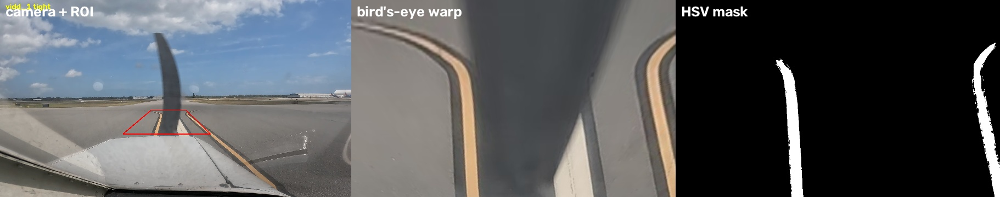
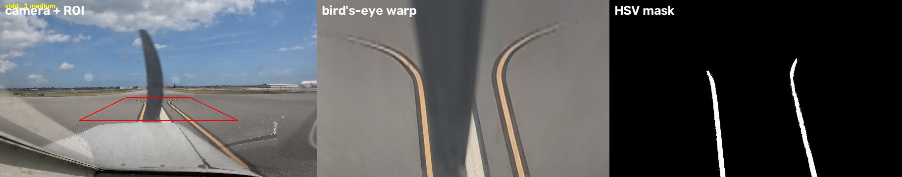
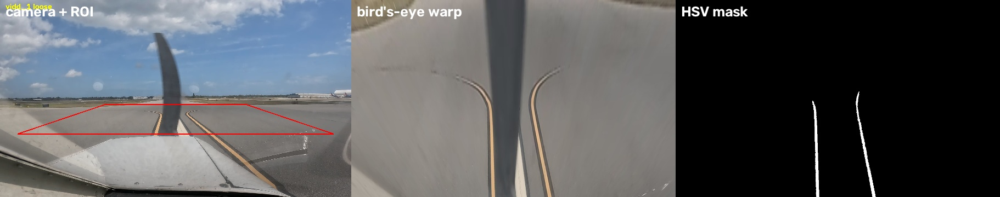

**vidd_2: tight, medium, loose**

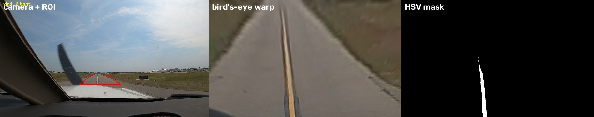
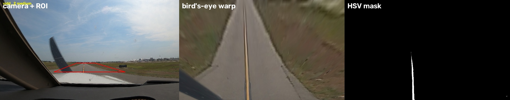
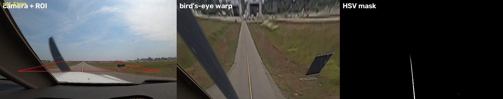

**vidd_3: tight, medium, loose, S ≥ 40, loose thresholds**

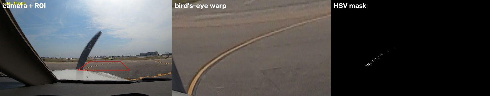
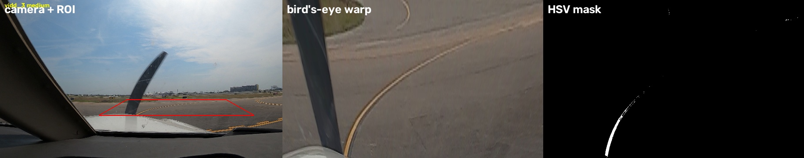
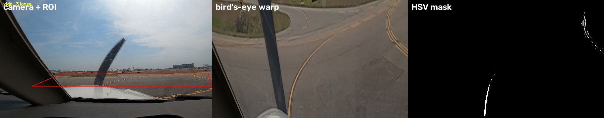
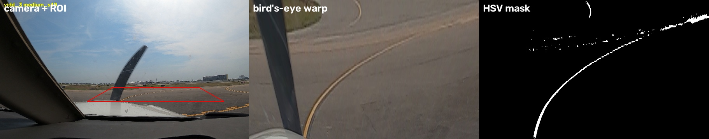
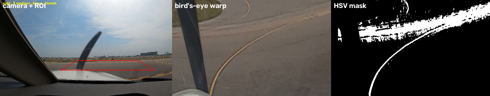

**Annotated outputs**

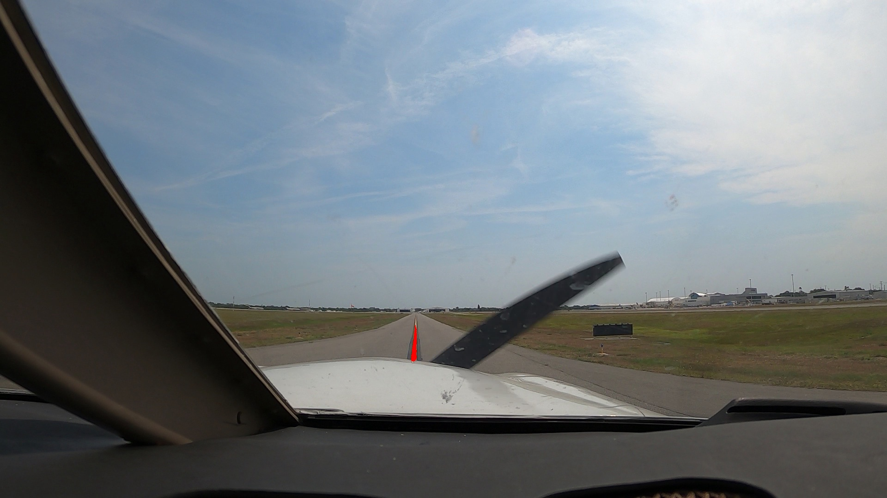
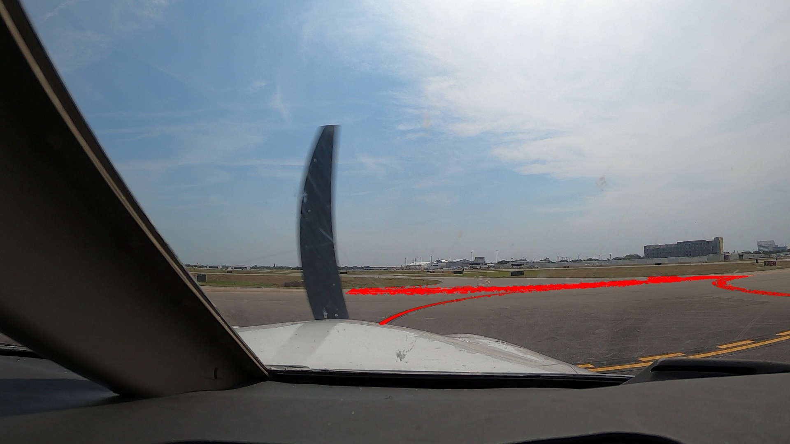

---

## Analysis

The short version is in [Q2Summary.md](Q2Summary.md).

- **Effect of ROI size on the warp:** every ROI is stretched to the same destination rectangle (1150 × 700 px), so the ROI size sets the magnification. A tight ROI magnifies the marking: in `vidd_1` tight, both edges of the marking become thick vertical bands. A loose ROI squeezes it: in `vidd_2` loose, the centerline becomes a thin, slanted stripe. Vertical magnification is large: a 65-row ROI fills 700 rows, about 11×. So a small change in the ROI's top edge changes the warp a lot.
- **Effect on detection:** detection uses a vertical-column histogram. The peak column needs more than `min_white_pixels=200` mask pixels and a peak above `peak_threshold=50`. A thin, slanted or curved line spreads its pixels across many columns, so no column passes, and the run labels 0/50 even when the mask is correct (`vidd_2` loose, `vidd_3` with S ≥ 40). A thick, vertical line puts hundreds of pixels in one column and passes easily. Run time follows the same logic: the more connected mask pixels, the longer CIRCLEDAT runs (50 ms for no detection, up to 5 s per frame for `vidd_1` tight).
- **Effect of the forced-horizontal edges:** `roi_points_to_quad` keeps only the y of the first top click and the first bottom click; the other two corners take those heights. So the top and bottom edges are always horizontal. This makes the result independent of a slightly crooked click, but the user cannot tilt the ROI to follow a line that turns. That matters on the curved `vidd_3` taxiway.
- **Effect of the 300-column dead zone:** `mask_ignore_left_columns=300` zeroes warp columns 0–300. The warp rectangle starts at x = 50, so the left 250 of its 1150 columns (about 22%) are ignored. A line must land in the right ~78% of the bird's-eye view. An ROI centred on the line puts it near the middle, which is safe. An ROI drawn too far right pushes the line into the dead zone, and it is silently discarded.
- **Best ROI per video and why:**
  - `vidd_2`: **medium**, 38/50 frames at 607 ms. The straight centerline lands thick and vertical, and the ROI ends above the aircraft nose.
  - `vidd_1`: **tight** (47/50) or **loose** (46/50) label the most frames, but at 2–5 s per frame. Medium labeled only 28/50. Its mask holds two thinner lines, and in many frames neither puts more than 200 pixels into a single column.
  - `vidd_3`: **none** with the default settings. The taxiway curves, so the line is diagonal in every warp.
- **Thresholds versus ROI:** loosening the color threshold alone (S ≥ 40) put the `vidd_3` curve into the mask but still labeled 0/50, because the histogram test, not the color test, was failing. Loosening the histogram thresholds as well rescued `vidd_3` (46/50), but added a false horizontal band and cost about 12 s per frame. Fixing the ROI is cheaper and cleaner than lowering thresholds until something passes.
- **What this means for automating the ROI in Q3:** a good ROI is one that makes the line **big and vertical in the bird's-eye view**. In practice:
  - centred on the line;
  - shallow, so the near paint fills the warp height;
  - ending just above the aircraft nose;
  - crossing the line at the same fraction of its top and bottom edges, so that the homography maps the line to a vertical one.

  These rules became the shared trapezoid builder in Q3 (see [Q3 design](Q3_AUTO_ROI.md#design-what-a-good-roi-is-from-q2)). An automated ROI can be judged by whether it produces that kind of warp, not by how closely it overlaps a hand-drawn ROI.
