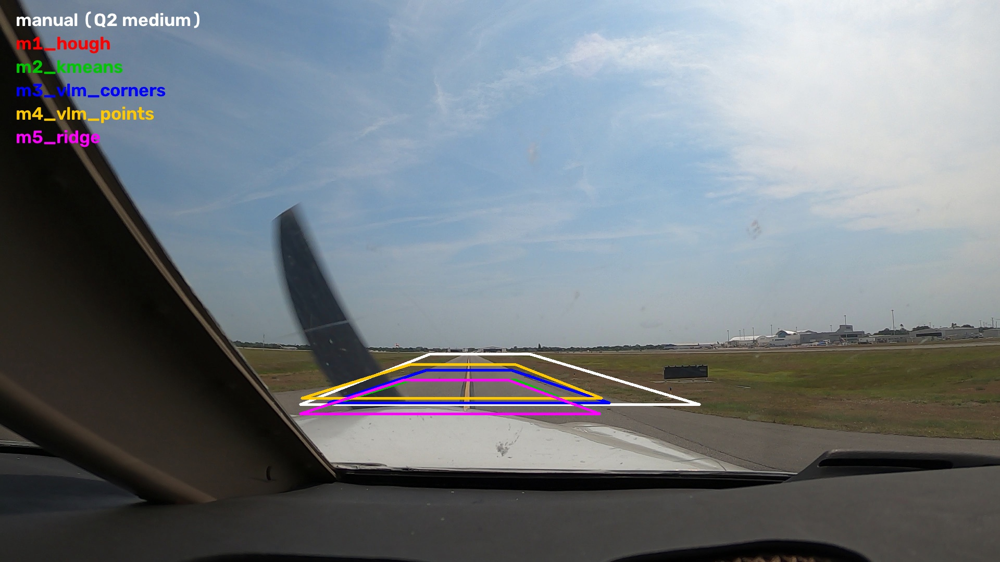
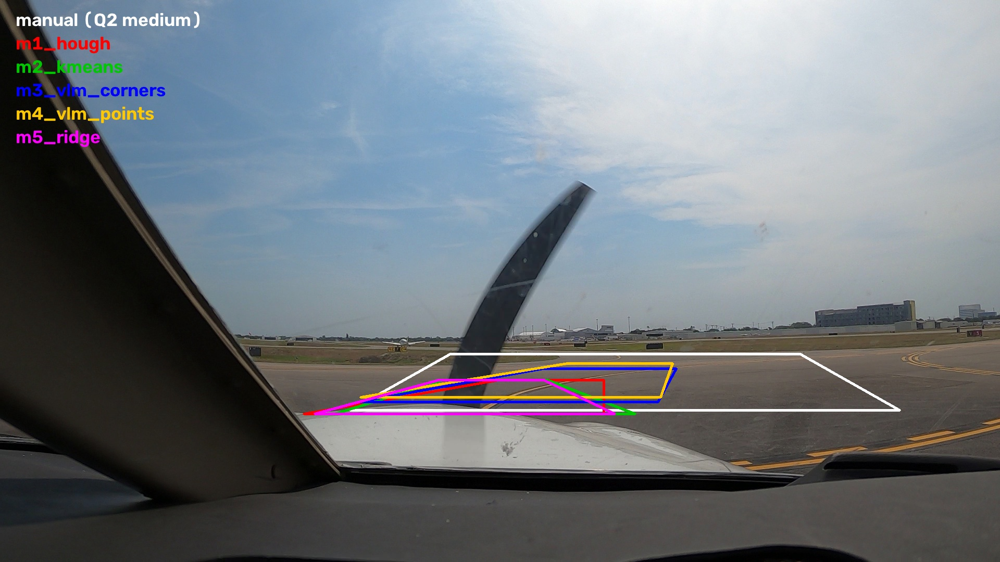
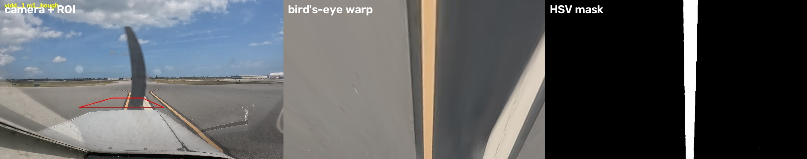
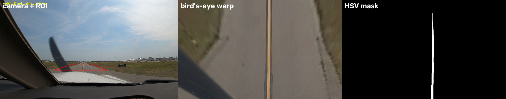
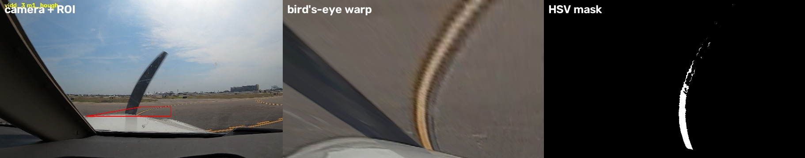

# Q3. Automating ROI selection: execution and analysis

[Back to README](../README.md#q3-automating-roi-selection) | [Assignment brief](../Assgn_4_Fall_26.pdf) | [Data used in Q3](data_used_in_q3.md) | [Q2 summary](Q2Summary.md)

This file holds the detailed record for Q3. The commands to run and the short summary live in the [README](../README.md#q3-automating-roi-selection).

---

## Integration point in the code

An automated ROI method must produce the same thing a user's clicks produce, so the rest of the pipeline stays unchanged:

- `process_image(img, roi_points, config)` in [`alina/pipeline.py`](../alina/pipeline.py) takes `roi_points` as a NumPy array of shape `(1, 6, 2)`. This is the format `select_roi` in [`alina/roi.py`](../alina/roi.py) returns: the clicks are stored as `[BL, TL, TL, TR, TR, BR]`.
- `roi_points_to_quad` turns that into the 4-corner trapezoid, forcing the top and bottom edges horizontal.
- Every Q3 method returns 4 corners (BL, TL, TR, BR), and `to_roi_points` in [`experiments/roi_methods/common.py`](../experiments/roi_methods/common.py) converts them to the 6-point format. Nothing in `alina/` is modified.

---

## Design: what a good ROI is (from Q2)

Q2 showed that ALINA only detects a line that is **thick and close to vertical in the bird's-eye view**, because detection is a per-column pixel count (`min_white_pixels=200`). So every method answers two questions about the frame, and one shared function builds the trapezoid:

1. **Where is the ego centerline?** A line `x = slope · y + intercept` in image pixels.
2. **Where does the aircraft nose start?** The bottom edge goes just above it, so no part of the aircraft enters the ROI.

`build_trapezoid` in [`common.py`](../experiments/roi_methods/common.py) places the trapezoid so that the centerline crosses its top and bottom edges **at the same fraction (55%) of their width**. A homography maps straight lines to straight lines, so the line becomes **exactly vertical** after the warp, and 55% keeps it clear of the 300 columns ALINA zeroes on the left. Fixed shape parameters: bottom width 30% of the frame, top width 35% of the bottom, depth 6% of the frame height.

**Why 6% deep:** only the near paint passes ALINA's HSV threshold (far paint is dimmer). A shallow ROI lets that bright paint fill the whole warped height. On the first frames of `vidd_1` and `vidd_2`, the peak column count rose from 154–498 at 11% depth to 522–700 at 6%. This was tuned with the methods' own first-frame line estimates and the column count only; no ground truth was used.

**Nose detector** (`detect_nose_top`): the lowest strong dark-above/bright-below horizontal edge in the lower middle of the frame. Taking the lowest peak avoids the horizon, which produces the same kind of edge higher up. Across all 150 frames it lands at 66–69% of the frame height for `vidd_1`, 74–76% for `vidd_2`, and 72–76% for `vidd_3`.

---

## Q3a. ML techniques to automate ROI selection on the first frame (20 points)

### Methods

| # | Method | Type | Model / library | Seed | How it finds the line | Code |
|---|---|---|---|---|---|---|
| 1 | Hough baseline | Classical CV (no learning) | OpenCV | – | Fixed HSV yellow threshold, Canny, probabilistic Hough; keep segments steeper than 20°; pick the group closest to the image centre at the bottom | [`m1_hough.py`](../experiments/roi_methods/m1_hough.py) |
| 2 | K-means paint clustering | Unsupervised ML | scikit-learn `KMeans` + `RANSACRegressor` | 42 | Cluster pavement-band pixels in Lab colour (k=10, lightness down-weighted); the non-green cluster with the highest b* (yellowness) is paint; RANSAC fits the line | [`m2_kmeans.py`](../experiments/roi_methods/m2_kmeans.py) |
| 3 | VLM corners (end to end) | Multimodal LLM | OpenAI `gpt-5.5` | 42 | The model returns the four ROI corners directly; the prompt states the Q2 rules for a good ROI. The reply is only validated, and top/bottom edges are made horizontal | [`m3_vlm_corners.py`](../experiments/roi_methods/m3_vlm_corners.py) |
| 4 | VLM centerline points | Multimodal LLM + geometry | OpenAI `gpt-5.5` | 42 | The model marks 5 points on the ego centerline and the nose-top row; the shared builder makes the trapezoid | [`m4_vlm_points.py`](../experiments/roi_methods/m4_vlm_points.py) |
| 5 | Ridge regression | Supervised ML | scikit-learn `RidgeCV` | 42 | Predicts the line's x at 60% and 72% of the frame height from a 32×18 HSV thumbnail plus a yellow mask. Trained **leave-one-video-out** on the published labels | [`m5_ridge.py`](../experiments/roi_methods/m5_ridge.py) |
| – | Manual ROI from Q2 (reference) | Human | – | – | Q2 medium trapezoid, drawn once by hand | [`results/q2/<video>/medium/roi.json`](../results/q2/) |

All methods except Method 3 use the shared nose detector (or, for Method 4, the model's own nose estimate) and `build_trapezoid`. If a method can't find a usable line, it falls back to a centred trapezoid above the nose and the run records it as a fallback. On the first frames this happened twice: M5 Ridge on `vidd_1` and M2 K-means on `vidd_3`.

### Method details

**VLM prompting (Methods 3 and 4).** Frames are downscaled to 1280×720 and sent with a **labelled pixel grid** (cyan lines every 10%, each labelled with its pixel value), and the reply is requested as JSON. Coordinates are scaled back to 1920×1080. The API key is read from the git-ignored `.env` and never logged. Code: [`vlm.py`](../experiments/roi_methods/vlm.py).

Model choice, tested on the three first frames (Method 4 prompt; true nose top ≈ 741, 780, 788 px):

| Model | Without grid | With grid |
|---|---|---|
| `gpt-4.1` (temperature 0) | Centerline at x = 962–988 on every video (the frame centre); nose 668–720 | Centerline at x = 960 on every video; nose 756–810 |
| `gpt-5.4-mini` | Close on `vidd_2`; drifts on `vidd_1` | Points on the wrong marking for `vidd_3` |
| `gpt-5.5` (default reasoning) | On the line in all three; nose 748–783 | On the line in all three; nose 756–786 |

GPT-4.1 does not localise the line at all (it answers the image centre), so both VLM methods use **`gpt-5.5` with the grid**. Low reasoning effort was 3× faster but put the `vidd_3` nose at 825 px instead of about 788. GPT-5 models don't accept `temperature`, so runs are not bit-for-bit deterministic; every reply is cached in `results/q3/proposals/` so the reported results are exactly reproducible from the cache.

**Supervised targets (Method 5).** For each training frame, RANSAC fits one line to the published label pixels, and the target is that line's x at two fixed rows. The model that labels `vidd_k` is trained only on the other two videos (87–98 frames), so there is no leakage. Caveat: the targets are the authors' published ALINA output, not independent ground truth.

### Metrics

Scored by [`experiments/q3_score.py`](../experiments/q3_score.py) with ALINA's own metric (x-set and y-set recall/precision averaged; [`eval/metrics.py`](../eval/metrics.py)). See [Data used in Q3](data_used_in_q3.md) for what each data source can and can't tell us.

- **CBEM F1 (accuracy):** against CBEM ground truth. Only 17 raw frames have it: 7 in `vidd_1`, 10 in `vidd_2`, **none in `vidd_3`**.
- **Published-label F1 (agreement):** against the authors' published ALINA labels, on every frame that has labels (50, 48 and 42 frames). This measures how closely a run reproduces the authors' labeling, **not true accuracy**.
- **Frames labeled** out of 50, **ms per frame** (ALINA pipeline), **ROI seconds** (time to propose the ROI), and **ROI IoU vs manual** (overlap with the Q2 medium trapezoid; low by design, since the automated ROIs are shallower).

### Results: first-frame ROI

From [`results/q3/summary.csv`](../results/q3/summary.csv). F1 values are percentages.

| Video | Method | Frames labeled | CBEM F1 (accuracy) | Published-label F1 (agreement) | ROI IoU vs manual | ROI time (s) | Pipeline ms/frame |
|---|---|---|---|---|---|---|---|
| vidd_1 | Manual (Q2 medium) | 28/50 | 23.8 | 46.5 | 1.00 | – | 2936 |
| vidd_1 | M1 Hough | **45/50** | **70.0** | **62.3** | 0.27 | 0.05 | 15670 |
| vidd_1 | M2 K-means | 20/50 | 15.9 | 7.5 | 0.27 | 0.36 | 5925 |
| vidd_1 | M3 VLM corners | 20/50 | 13.2 | 5.8 | 0.16 | 28.6 | 6267 |
| vidd_1 | M4 VLM points | 25/50 | 64.2 | 32.5 | 0.22 | 27.9 | 9227 |
| vidd_1 | M5 Ridge (fallback ROI†) | 43/50 | 25.0 | 38.8 | 0.27 | 4.3* | 8100 |
| vidd_2 | Manual (Q2 medium) | 38/50 | **91.6** | 76.7 | 1.00 | – | 607 |
| vidd_2 | M1 Hough | 39/50 | 83.2 | 68.7 | 0.29 | 0.03 | 4533 |
| vidd_2 | M2 K-means | 39/50 | 83.4 | 68.9 | 0.29 | 0.32 | 4558 |
| vidd_2 | M3 VLM corners | 39/50 | 88.6 | 76.0 | 0.48 | 17.2 | 4021 |
| vidd_2 | M4 VLM points | 39/50 | 91.3 | **77.5** | 0.53 | 7.0 | 2086 |
| vidd_2 | M5 Ridge | 38/50 | 82.7 | 67.1 | 0.29 | 4.8* | 3723 |
| vidd_3 | Manual (Q2 medium) | 0/50 | – | 0.0 | 1.00 | – | 52 |
| vidd_3 | M1 Hough | **16/50** | – | **32.8** | 0.22 | 0.04 | 929 |
| vidd_3 | M2 K-means (fallback ROI†) | 0/50 | – | 0.0 | 0.22 | 0.40 | 51 |
| vidd_3 | M3 VLM corners | 0/50 | – | 0.0 | 0.29 | 37.0 | 67 |
| vidd_3 | M4 VLM points | 0/50 | – | 0.0 | 0.27 | 22.4 | 72 |
| vidd_3 | M5 Ridge | 0/50 | – | 0.0 | 0.22 | 4.9* | 71 |

\* Ridge time includes training its leave-one-video-out model on the first call; a prediction alone takes milliseconds.

† The method's own first-frame line was unusable (flatter than about 18° from horizontal, or the trapezoid collapsed when clipped to the frame), so the run used the centred fallback ROI above the nose. A sanity check (`sanitize` in [`common.py`](../experiments/roi_methods/common.py)) applies this to every method and frame. Before it existed, one collapsed `vidd_3` trapezoid warped a sliver of the image across the whole bird's-eye view and ALINA traced 280,665 "line" pixels in a single frame.

### Visual evidence

Each overlay shows every method's first-frame ROI against the Q2 manual ROI (white). Per-method evidence (`roi.json`, `roi_overlay.jpg`, `birds_eye.jpg`, `mask.jpg`, `compare.jpg`) is in `results/q3/runs/<method>/<video>/first-frame/`.

Bird's-eye view and mask for the best method on each video:

### Analysis

- **Best method and why:** no single winner. **M1 Hough** is best on `vidd_1` (CBEM F1 70.0 vs 23.8 for the manual ROI) and is the only method that labels anything on `vidd_3`. **M4 VLM points** is best among the automated methods on `vidd_2` (91.3, matching the manual 91.6) and second on `vidd_1` (64.2). Both share the line-centred trapezoid: the line-following geometry, not the model, is what turned the Q2 failures into detections.
- **Locating the line beats drawing the box.** M3 (VLM draws the corners) and M4 (VLM only points at the line) use the same model. M4 is better on both scored videos (64.2 vs 13.2 on `vidd_1`, 91.3 vs 88.6 on `vidd_2`), because recognition is what the model is good at, while the exact geometry ALINA needs is easy to compute.
- **Which marking counts.** `vidd_1` has two yellow lines. M1 and M4 centred on the left one; M2 and M3 on the right one. In 5 of the 7 `vidd_1` CBEM frames the ground truth covers only the left line (x = 840–884 px; the other 2 cover both), which explains most of the F1 gap.
- **Failure cases:** M5 Ridge on `vidd_1`: its predicted line was unusable, so it ran on the fallback ROI (CBEM F1 25.0). With only two training videos, it learns where the line sits in those videos rather than how to find it, and it fell back on 35 of 50 `vidd_1` frames in Q3b. All methods but M1 on `vidd_3`: the washed-out paint barely passes ALINA's default HSV threshold, so no ROI can produce a mask; M1's leaning ROI keeps the near curve thick enough in 16 frames. This is a colour-threshold problem, addressed in Q4.
- **Cost:** classical and unsupervised methods propose an ROI in under 0.4 s; GPT-5.5 takes 7–37 s per call. The shallow ROI makes the line bigger in the warp, so ALINA's CIRCLEDAT traversal has more pixels to follow: up to 15.7 s per frame on `vidd_1`, against 2.9 s for the manual ROI.
- **Run-to-run stability:** M1, M2 and M5 are deterministic (fixed seed 42). GPT-5.5 replies vary between calls (no temperature control); the model comparison above showed nose estimates within about ±10 px across settings. The reported results come from the cached replies.

---

## Q3b. Automated ROI on every frame (5 points)

**Question:** apply the automated approach to each frame instead of only the first, and compare ROI selection between frames. Does it improve performance?

### Experiment design

- **Methods compared:** all five methods, run (a) once on the first frame (Q3a) and (b) on every frame. Every proposal goes through the same sanity check; an unusable ROI is replaced by the centred fallback and counted.
- **Frames:** all 50 frames of each video. The 50 frames are sparse samples from long recordings (for example `vidd_1` jumps from frame 00007 to 01063), so consecutive frames can show quite different scenes; temporal smoothing across those gaps would not be meaningful, so none is applied.
- **ROI change between frames:** mean corner movement (px) and mean IoU with the previous frame's ROI.

### Data caveat: the GPT methods are partial

The OpenAI account ran out of credits during the every-frame run (`insufficient_quota`), and 146 of the 300 GPT-5.5 calls failed. Those frames are **left out of every metric** for the GPT methods. So M3 is scored on 50, 17 and 18 frames (`vidd_1`, `vidd_2`, `vidd_3`), and M4 on 33, 19 and 17. To compare like with like, the GPT rows below score the first-frame run on exactly the same frames. The cache keeps only real replies, so adding credits and re-running `q3_auto_roi --modes every-frame` completes them without repeating any call.

### Results

From [`results/q3/summary.csv`](../results/q3/summary.csv). "First → every" shows the first-frame value, then the every-frame value, on the same frames. CBEM F1 is accuracy (`vidd_1` and `vidd_2` only); published-label F1 is agreement with the authors' labeling.

| Video | Method | Frames scored | Frames labeled (first → every) | CBEM F1 (first → every) | Published-label F1 (first → every) | Fallbacks (every) | ROI jitter, px | ROI time per frame (s) |
|---|---|---|---|---|---|---|---|---|
| vidd_1 | M1 Hough | 50 | 45 → 47 | 70.0 → **71.5** | 62.3 → 64.8 | 0 | 41 | 0.04 |
| vidd_1 | M2 K-means | 50 | 20 → 47 | 15.9 → 38.5 | 7.5 → 50.3 | 0 | 49 | 0.23 |
| vidd_1 | M3 VLM corners | 50 | 20 → 47 | 13.2 → 25.1 | 5.8 → 40.2 | 0 | 54 | 14.9 |
| vidd_1 | M4 VLM points (partial) | 33 | 23 → 31 | 64.2 → 56.8 | 47.2 → 55.1 | 0 | 87 | 35.6 |
| vidd_1 | M5 Ridge | 50 | 43 → 32 | 25.0 → 26.5 | 38.8 → 24.8 | 35 | 112 | 0.19 |
| vidd_2 | M1 Hough | 50 | 39 → 37 | 83.2 → 82.8 | 68.7 → 65.7 | 3 | 37 | 0.04 |
| vidd_2 | M2 K-means | 50 | 39 → 40 | 83.4 → 82.8 | 68.9 → 66.9 | 7 | 33 | 0.19 |
| vidd_2 | M3 VLM corners (partial) | 17 | 13 → 14 | 88.6 → 88.2 | 76.6 → 82.4 | 0 | 53 | 20.7 |
| vidd_2 | M4 VLM points (partial) | 19 | 16 → 17 | 90.6 → **90.8** | 84.8 → 84.0 | 0 | 37 | 20.4 |
| vidd_2 | M5 Ridge | 50 | 38 → 35 | 82.7 → 82.4 | 67.1 → 60.3 | 0 | 11 | 0.20 |
| vidd_3 | M1 Hough | 50 | 16 → **22** | – | 32.8 → **45.4** | 10 | 130 | 0.04 |
| vidd_3 | M2 K-means | 50 | 0 → 13 | – | 0.0 → 26.6 | 32 | 46 | 0.25 |
| vidd_3 | M3 VLM corners (partial) | 18 | 0 → 11 | – | 0.0 → 25.8 | 0 | 329 | 29.5 |
| vidd_3 | M4 VLM points (partial) | 17 | 0 → 9 | – | 0.0 → 25.3 | 3 | 117 | 35.3 |
| vidd_3 | M5 Ridge | 50 | 0 → 0 | – | 0.0 → 0.0 | 0 | 9 | 0.20 |

The M4 `vidd_2` CBEM comparison rests on 5 ground-truth frames, and M3 `vidd_2` on 5; the rest use 7 or 10. ROI jitter is the mean movement of the four corners between consecutive scored frames.

### Answer

- **Does per-frame ROI improve performance?** Only where the first-frame ROI was poor or the scene changes; not for a good ROI on a straight taxiway.
  - **It helps when the first ROI was wrong.** On `vidd_1`, M2 and M3 had centred on the wrong yellow line in frame 1. Re-proposing lets them recover: CBEM F1 15.9 → 38.5 and 13.2 → 25.1, with frames labeled 20 → 47.
  - **It helps on the curved `vidd_3`.** A fixed ROI from frame 1 misses the curve as it moves. Every method except Ridge goes from 0–16 frames labeled to 9–22, and M1 Hough reaches 22 frames with agreement 32.8 → 45.4.
  - **It doesn't help a good ROI on a straight taxiway.** On `vidd_2` every method stays within about 1 CBEM point (for example M4 90.6 → 90.8, M1 83.2 → 82.8). The best `vidd_1` methods barely move or get worse: M1 70.0 → 71.5, M4 64.2 → 56.8.
  - **It amplifies a weak method.** M5 Ridge falls back on 35 of 50 `vidd_1` frames and labels fewer frames (43 → 32).
- **Cost:**
  - **Time and money:** ROI proposal moves from once per video to once per frame, 50 times as often. That's negligible for M1, M2 and M5 (under 0.3 s), but for GPT-5.5 it's 15–36 s and one paid API call per frame, about 300 calls for the three videos.
  - **Jitter:** the ROI moves 33–130 px per frame on average for the classical and supervised methods, and up to 329 px for M3 on `vidd_3`. The 50 frames are sparse samples, so some of that movement is real scene change, not noise.
- **Overall:** the best automated setup per video is the same in both modes: M1 Hough for `vidd_1` and `vidd_3`, M4 VLM points for `vidd_2`. Per-frame ROI is worth it for curves and scene changes, and should be paired with a sanity check (here, `sanitize` plus a fallback), because one bad frame can produce a collapsed trapezoid.
