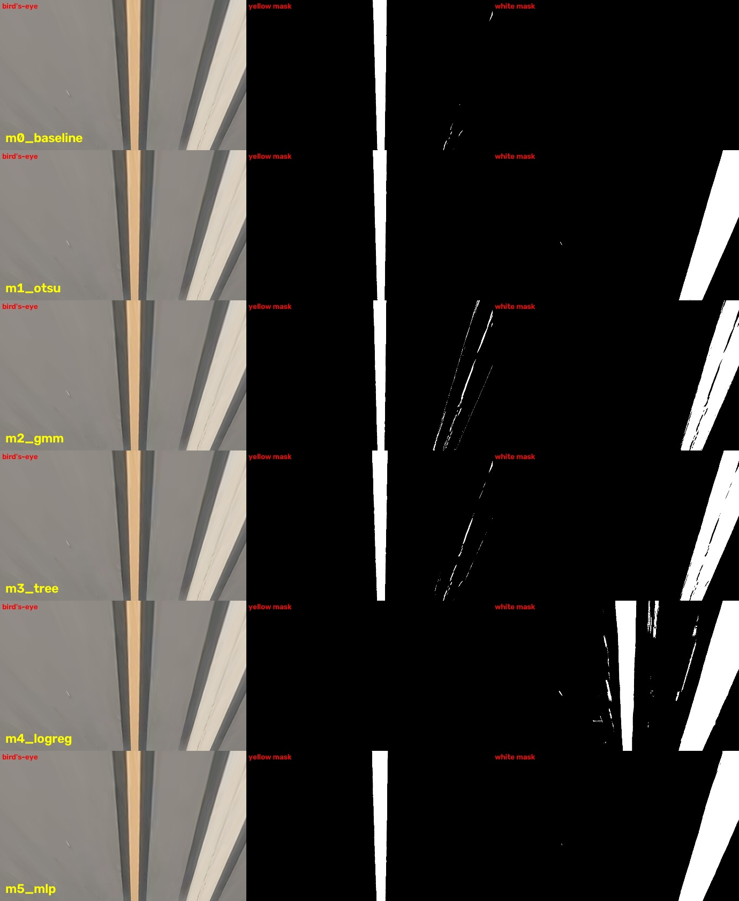

# Q4. ML-based color thresholding: execution and analysis

[Back to README](../README.md#q4-ml-based-color-thresholding) | [Assignment brief](../Assgn_4_Fall_26.pdf) | [Evaluation approach](EVALUATION.md)

This file holds the detailed record for Q4. The commands to run and the short summary live in the [README](../README.md#q4-ml-based-color-thresholding).

**Task:** explore ML techniques to identify the color thresholds for line markings (yellow and white taxiway lines), replacing the current manually set thresholding step (20 points).

---

## Current baseline

- **Where:** `cv2.inRange(color_features, lower, upper)` in `process_image` in [`alina/pipeline.py`](../alina/pipeline.py). The bounds come from `yellow_lower` and `yellow_upper` in [`alina/config.py`](../alina/config.py).
- **Values:** HSV `(0, 70, 170)` to `(255, 255, 255)`, applied after per-frame min-max normalization ([`alina/color.py`](../alina/color.py)).
- **Hue is fully open,** so the mask keys on saturation ≥ 70 and brightness ≥ 170.
- **White lines are missed.** Confirmed: on the `vidd_1` frames with a white stripe the baseline's white F1 is 0 (white paint has S ≈ 40–65 after normalization, below the S ≥ 70 bound). The baseline is a yellow-only detector.

## Integration point in the code

Every method is a class in [`experiments/color_methods/`](../experiments/color_methods/) with `masks(warped) -> Masks(yellow, white)`. [`label_frame`](../experiments/color_methods/common.py) is `process_image` with the `cv2.inRange` line replaced by that call; the warp, the left-column zeroing, the histogram, CIRCLEDAT and the unwarp are ALINA's own functions, and `alina/` itself is not modified.

- **Check:** with the baseline plugged in, `label_frame` returns exactly the same pixels as ALINA's `process_image` (verified on `vidd_2/00005`: 447 px, identical sets).
- **What goes into ALINA:** `--use yellow` feeds the yellow mask (what the original step does, and what the CBEM ground truth marks); `--use both` feeds yellow ∪ white.

## Fixed ROI

Every method uses the same ROI per video, so only the color step varies: the Q3a M1 (Hough) first-frame ROI, the only automatic ROI that labeled all three videos (`FIXED_ROI` in `common.py`). Corners (BL, TL, TR, BR) in 1080p pixels:

| Video | ROI |
|---|---|
| `vidd_1` | (535,730) (760,665) (962,665) (1111,730) |
| `vidd_2` | (576,795) (786,730) (988,730) (1152,795) |
| `vidd_3` | (583,795) (957,730) (1159,730) (1159,795) |

---

## Training and labeling data

All labels are converted into the bird's-eye view of the fixed ROI, which is where the threshold operates.

| Use | Yellow | White | Background |
|---|---|---|---|
| **Training** (supervised methods) | Published ALINA labels (`data/Labeled_Data`), all frames with labels | Hand-traced stripe, `vidd_1` frames 00010, 00014, 00018 | ROI pixels ≥ 15 px from any yellow/white label |
| **Testing** (mask quality) | CBEM ground truth, filled (17 frames: `vidd_1` 7, `vidd_2` 10) | Hand-traced stripe, `vidd_1` frames 00002, 00004–00007 | – |

- **CBEM yellow, filled.** CBEM marks the *edges* of the paint (Canny inside a hand-traced contour). For pixel metrics each row is filled between consecutive edges where the gap is brighter than the nearby pavement, so the black outlines between stripes stay empty. Brightness only, no color threshold enters the ground truth. Only rows the annotator traced are scored.
- **Dataset quirk:** the CBEM files are copies. `vidd_1` 00002–00007 share one identical file, and 01063/01065 share another, so `vidd_1` has only two distinct tracings.
- **White labels.** The dataset has no white labels, and white paint appears inside an ROI in only one place: the black-outlined white lane stripe beside the yellow line in `vidd_1` frames 00001–00020. It was labeled the CBEM way: a polygon traced by hand around the stripe (rows 660–740, all ROI rows), then an automatic split inside it (2-means on gray: white paint vs. black outline). `vidd_1` stripe frames without a white label are left out of training, so unlabeled white paint never becomes a background sample.
- **White false positives** are measured on frames known to have no white paint in the ROI: `vidd_1` 01063/01065 and the 10 `vidd_2` CBEM frames (whose ROI contains the white aircraft nose, a realistic trap).
- **Split:** leave-one-video-out for yellow (train on two videos, test on the third). White exists only in `vidd_1`, so the three white training frames are always used; the five white test frames are different frames. Their yellow samples are dropped when `vidd_1` is the test video.
- **Seed:** 42 everywhere (sampling, GMM, tree, logistic regression, MLP).
- **Training set size:** per video 400 yellow, 400 white and 1,500 background pixels per frame: `vidd_1` 58,200 samples (1,200 white), `vidd_2` 91,200, `vidd_3` 75,804.
- **Weak-label caveat:** the published labels are the authors' ALINA output, not independent truth. They are used only for training and for the reproduction metric (`pub_f1`), never for the pixel-level test.

---

## Methods (5 + baseline)

| # | Method | Type | Input features | Seed | Thresholds produced |
|---|---|---|---|---|---|
| 0 | Hand-set HSV range (baseline) | Rule | Normalized HSV | – | Fixed box, yellow only |
| 1 | Otsu per frame | Unsupervised, per frame | Normalized S, V | – | Per-frame t_S, t_V (yellow), t_W (white) |
| 2 | Gaussian mixture per frame | Unsupervised clustering | CIE Lab | 42 | Per-frame clusters named yellow / white |
| 3 | Decision tree (depth 3) | Supervised | Normalized HSV | 42 | Explicit HSV boxes (`inRange` drop-in) |
| 4 | Logistic regression | Supervised, linear | Normalized HSV + Lab | 42 | Oblique linear boundary |
| 5 | MLP with neighborhood context | Neural network | 20 per pixel: HSV+Lab, 5×5 and 15×15 means, 5×5 std of V and L | 42 | None (learned function) |

### Method details

- **M1 Otsu** ([`m1_otsu.py`](../experiments/color_methods/m1_otsu.py)). Per frame, Otsu picks t_S and t_V over the usable ROI pixels: yellow = S > t_S and V > t_V. White = S ≤ t_S and V > t_W, where t_W is Otsu over V of the low-saturation pixels only. Otsu always splits, even a single-material frame, so a split is accepted only if the class means are ≥ 60 apart; otherwise that color is reported absent.
- **M2 Gaussian mixture** ([`m2_gmm.py`](../experiments/color_methods/m2_gmm.py)). Per frame, a 5-component full-covariance GMM on 20,000 sampled ROI pixels in Lab. Yellow = the component with the highest b*, if b* ≥ 140 (128 is neutral). White = the brightest near-neutral component (chroma < 12), if its L is ≥ 35 above the dominant (pavement) component. Each pixel takes its most likely component.
- **M3 Decision tree** ([`m3_tree.py`](../experiments/color_methods/m3_tree.py)). Depth 3, balanced class weights, 3 classes. Each leaf is an axis-aligned HSV box, so the learned model is literally a set of `cv2.inRange` bounds (table below).
- **M4 Logistic regression** ([`m4_logreg.py`](../experiments/color_methods/m4_logreg.py)). Multinomial, standardized features, balanced class weights. Its boundary can be oblique (e.g. high b* relative to L), which a per-channel range cannot express.
- **M5 MLP** ([`m5_mlp.py`](../experiments/color_methods/m5_mlp.py)). Hidden layers 32-16, early stopping. The context features let it use local shape (a thin bright stripe vs. a large bright area). It stands in for a small CNN; PyTorch is not available on this Intel Mac.
- **Foundation-model segmentation** (template row 5) was not run: the OpenAI credits ran out during Q3, and there is no local GPU/PyTorch.

---

## Results

Evaluated per [EVALUATION.md](EVALUATION.md), same ROI for every method. ALINA's metric (`eval/metrics.py`, x-set/y-set recall and precision, averaged) is reported in %; `vidd_3` has no CBEM ground truth, so frames labeled and agreement with the published labels are given instead.

### End-to-end, yellow mask into ALINA (CBEM ground truth)

| Method | `vidd_1` R / P / **F1** | `vidd_2` R / P / **F1** | Frames labeled (`vidd_1` / `vidd_2` / `vidd_3`, of 50) |
|---|---|---|---|
| Baseline HSV | 59.1 / 96.0 / **70.0** | 78.3 / 88.9 / **83.2** | 45 / 39 / 16 |
| M1 Otsu | 52.6 / 99.4 / **66.2** | 78.3 / 83.7 / **80.8** | 43 / 29 / 2 |
| M2 GMM | 52.5 / 99.5 / **66.0** | 79.6 / 62.1 / **67.5** | 44 / 34 / 19 |
| M3 Tree | 54.2 / 99.2 / **67.6** | 81.0 / 41.3 / **54.6** | 45 / 48 / 35 |
| M4 LogReg | 16.0 / 42.9 / **22.1** | 79.2 / 81.4 / **80.2** | 29 / 41 / 35 |
| M5 MLP | 53.9 / 98.5 / **67.0** | 81.0 / 82.8 / **81.9** | 44 / 39 / 18 |

### Extra metrics: agreement with published labels and speed

| Method | Published-label F1 (`vidd_1` / `vidd_2` / `vidd_3`) | Color step, ms/frame | Whole pipeline, ms/frame (`vidd_1` / `vidd_2` / `vidd_3`) |
|---|---|---|---|
| Baseline HSV | 62.3 / 68.7 / 32.8 | 23–28 | 30,257 / 7,570 / 1,455 |
| M1 Otsu | 58.2 / 50.7 / 4.5 | 58–83 | 26,123 / 7,235 / 571 |
| M2 GMM | 57.8 / 49.6 / 13.7 | 1,117–1,740 | 29,544 / 11,966 / 26,380 |
| M3 Tree | 59.7 / 56.3 / 46.0 | 114–132 | 27,821 / 37,295 / 33,011 |
| M4 LogReg | 34.1 / 67.9 / 45.9 | 298–347 | 22,757 / 12,228 / 32,129 |
| M5 MLP | 59.5 / 68.4 / 40.4 | 1,380–1,612 | 24,164 / 9,161 / 5,272 |

Pipeline times were measured with 10 runs in parallel on 12 CPUs, so they are inflated, but equally for all methods. The color step is a small part; CIRCLEDAT dominates and grows with the number of connected mask pixels.

### Mask quality (pixel level, yellow vs. white)

Pooled pixel counts inside the usable bird's-eye ROI. Yellow: vs. filled CBEM (`vidd_1` + `vidd_2`). White: vs. the traced stripe (5 `vidd_1` frames). White FP: % of ROI pixels called white on 12 frames with no white paint.

| Method | Yellow IoU | Yellow F1 | Yellow F1 `vidd_1` / `vidd_2` | White IoU | White F1 | White FP % |
|---|---|---|---|---|---|---|
| Baseline HSV | 0.793 | 0.884 | 0.903 / 0.835 | 0 | 0 | 0 |
| M1 Otsu | 0.790 | 0.883 | 0.899 / 0.845 | 0.542 | 0.703 | 30.05 |
| M2 GMM | 0.686 | 0.814 | 0.792 / 0.866 | 0.871 | 0.931 | 1.63 |
| M3 Tree | 0.820 | 0.901 | 0.902 / 0.899 | 0.923 | 0.960 | 0.05 |
| M4 LogReg | 0.661 | 0.796 | 0.752 / 0.888 | 0.618 | 0.764 | 0.34 |
| **M5 MLP** | **0.831** | **0.907** | 0.899 / **0.927** | **0.967** | **0.983** | **0.01** |

### Learned thresholds (methods that output explicit bounds)

Normalized HSV, 0–255 per channel (ALINA's scale). Tree boxes are from the model trained without `vidd_2` (the column says which video each model was tested on); a mask is the union of its boxes.

| Method | Yellow | White |
|---|---|---|
| Baseline | (0,70,170)–(255,255,255) | – |
| M3 Tree, tested on `vidd_1` (trained on `vidd_2`, `vidd_3`) | (0,59,121)–(255,255,204) ∪ (0,71,205)–(255,255,255) | (0,21,205)–(255,70,255) |
| M3 Tree, tested on `vidd_2` (trained on `vidd_1`, `vidd_3`) | (0,69,115)–(255,255,255) ∪ (0,120,0)–(255,255,114) ∪ (0,0,167)–(255,66,201) ∪ 2 thin S-slices | (0,0,202)–(255,66,255) |
| M3 Tree, tested on `vidd_3` (trained on `vidd_1`, `vidd_2`) | (0,69,140)–(19,255,255) ∪ (20,69,0)–(255,255,255) | (0,25,191)–(255,68,255) |
| M1 Otsu (per frame, median [min–max]) | t_S: `vidd_1` 78 [67–107], `vidd_2` 66 [60–69], `vidd_3` 63; t_V: 160 / 86 / 101 | t_W: 156 / 85 / 91 |
| M2 GMM (median cluster mean, Lab) | `vidd_1` (179,135,159), `vidd_2` (156,133,146), `vidd_3` (90,129,143) | `vidd_1` (166,129,130), `vidd_2` (183,127,131), `vidd_3` (179,127,131) |

The learned yellow bounds land on the same saturation cut as the hand-set ones (S ≈ 59–71 vs. 70), but they lower or remove the brightness bound (V ≥ 115–140 instead of 170). The tree also learns a white rule the baseline lacks: low saturation (S ≤ 66–70) and high brightness (V ≥ 191–205).

### Plots and visual evidence

All in `results/q4/figures/` (made by `experiments.q4_figures`); per-run panels are in `results/q4/runs/<method>/yellow/<video>/masks/`.

- **HSV histograms** of background, yellow and white training pixels, with the baseline bound and the tree boxes: `hsv_histograms.png`.
- **Mask comparisons**, every method stacked as bird's-eye | yellow mask | white mask: `masks_vidd_1_00004.jpg` (sunny, yellow line + white stripe), `masks_vidd_1_01063.jpg` (yellow star marking), `masks_vidd_2_00005.jpg` (overcast, aircraft nose in view), `masks_vidd_3_18970.jpg`.

---

## Analysis

- **Hue is useless after ALINA's normalization; saturation does the work.** In the histograms, paint and pavement sit at the same normalized hue (≈ 25), so the baseline's fully open hue range is correct. Yellow separates from pavement on S, and every learned yellow rule re-discovers the hand-set cut at S ≈ 60–70. What the learned rules change is the V bound: they let darker yellow through (V ≥ 115–140), which matters in shade and on `vidd_3`.
- **Best method and why: M5 MLP for the masks; the baseline still ties or wins end-to-end on yellow.** The MLP has the best yellow (F1 0.907) and white (0.983) masks with almost no false white (0.01%). It is the only model that sees context, so it can tell a thin bright stripe from a large bright surface. End-to-end, its CBEM F1 is within 1.5–3 points of the baseline on `vidd_1` and `vidd_2`. Yellow on these two videos was already easy for the hand-set range (mask F1 0.88), so there was little left to gain.
- **A better mask is not always a better label.** ALINA keeps everything connected to the histogram peak, so one wrong blob touching the line costs more than many scattered errors. The tree has a good yellow mask on `vidd_2` (F1 0.899) but end-to-end precision falls to 41%. Trained on `vidd_1` + `vidd_3`, it learned a box (0,0,167)–(255,66,201) that also covers the cream aircraft nose at the bottom of the `vidd_2` warp. The nose touches the line, so CIRCLEDAT pulls it in. The pixel score misses this because the nose lies below the rows the CBEM annotator traced.
- **Robustness to lighting (sunny vs. cloudy) and across videos.** The supervised models are tested on a video they never saw, which exposes lighting shift. Logistic regression collapses on sunny `vidd_1` (CBEM F1 22.1). Trained on the darker yellow of the overcast videos plus `vidd_1`'s white stripe, its linear boundary calls the pale sunlit yellow "white" (see the mask comparison). The per-frame unsupervised methods adapt to lighting by construction, but they have no notion of "line". Otsu always finds two classes, and on `vidd_3` (little paint in the ROI) its yellow split fails the separation check in 48/50 frames. The GMM's "yellow" cluster on `vidd_3` is dark (L ≈ 90), i.e. a yellowish patch of pavement or grass, not paint.
- **`vidd_3` is where learned thresholds help most.** The baseline labels 16/50 frames; the tree and logistic regression label 35/50 and agree better with the published labels (F1 46 vs. 33). Their lower V bound accepts the dimmer paint. There is no CBEM ground truth for `vidd_3`, so this is coverage and agreement, not proven accuracy.
- **Yellow vs. white performance.** The baseline cannot find white at all (F1 0). Every learned method can, and the supervised ones do it with almost no false positives on the aircraft nose or bright pavement. In the histograms white overlaps sunlit pavement in V, so a color-only rule (Otsu: 30% false white) is not enough; context (MLP) or a narrow saturation band (tree) is. The white result rests on one stripe in one video (3 training and 5 test frames), so it shows feasibility rather than a general white detector.
- **Speed vs. accuracy trade-off.** The color step costs 25 ms (baseline), 60–130 ms (Otsu, tree), 300 ms (logistic regression) and 1.1–1.7 s (GMM, MLP). All of this is small next to CIRCLEDAT (1–37 s per frame here), whose cost grows with the connected mask area. The tree is the practical pick for a drop-in replacement: it outputs plain `inRange` boxes (as fast as the baseline once exported) and adds a white rule. The MLP is the pick when mask quality matters, e.g. as a pre-labeling tool.
- **Recommendation.** Keep the hand-set yellow range as the default for clear, sunny footage. Add the tree's white box (S ≤ ~66, V ≥ ~200) to detect white lines. Use the MLP, trained on all three videos, where lighting differs from the training footage. Train with ROI crops that include the aircraft nose as background, which would have prevented the tree's `vidd_2` failure.

### Yellow + white fed into ALINA (`--use both`)

Same runs, but ALINA receives yellow ∪ white. CBEM F1 (`vidd_1` / `vidd_2`) and frames labeled (`vidd_1` / `vidd_2` / `vidd_3`), with the change from the yellow-only run in brackets.

| Method | CBEM F1 `vidd_1` | CBEM F1 `vidd_2` | Frames labeled |
|---|---|---|---|
| Baseline HSV | 70.0 (=) | 83.2 (=) | 45 / 39 / 16 (no white rule) |
| M1 Otsu | 61.5 (−4.7) | 67.3 (−13.5) | 43 / 30 / 16 |
| M2 GMM | 66.0 (=) | 54.6 (−12.9) | 47 / 34 / 19 |
| M3 Tree | 67.6 (=) | 54.6 (=) | 47 / 48 / 35 |
| M4 LogReg | 68.8 (+46.7) | 65.5 (−14.8) | 47 / 41 / 35 |
| M5 MLP | 67.0 (=) | 81.7 (−0.2) | 47 / 39 / 18 |

- **The MLP and the tree can add white safely.** Their scores barely move, because they produce almost no false white near the yellow line. All methods with a white rule label 47/50 frames on `vidd_1` (vs. 43–45), picking up frames where the white stripe gives the strongest histogram peak.
- **Noisy white rules hurt.** Otsu and the GMM call parts of the aircraft nose or pavement white on `vidd_2`; that joins the line and drops precision (−13 points).
- **Logistic regression is "rescued" on `vidd_1`** (22.1 → 68.8) only because the yellow line it misnamed as white now reaches ALINA anyway. The line is found, but under the wrong color name.
- CBEM only marks yellow paint, so a detected white stripe counts as a false positive here; these numbers can only show harm from adding white, not benefit.
