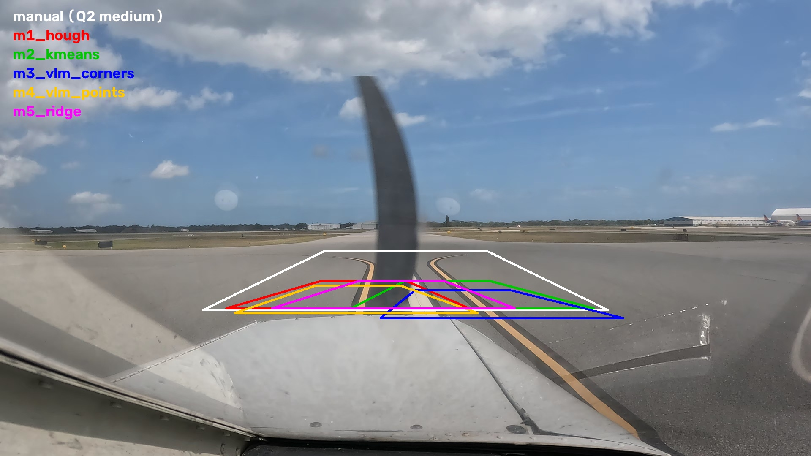
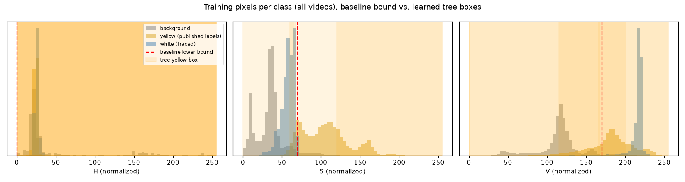
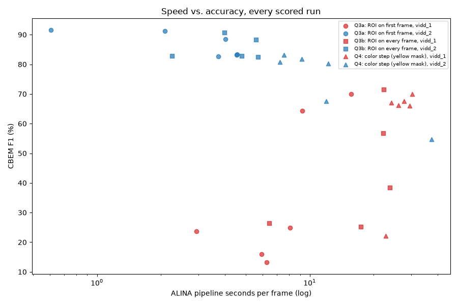
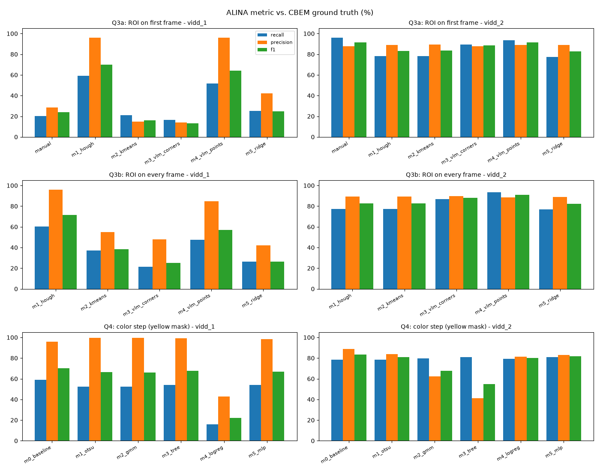

# Assignment 4 Report: Automating ALINA's Manual Steps with Machine Learning

**Repository:** [github.com/hatemphd/ALINA](https://github.com/hatemphd/ALINA) (fork of [hafeezkhan909/ALINA](https://github.com/hafeezkhan909/ALINA))
**Paper:** Khan et al., *ALINA: Advanced Line Identification and Notation Algorithm*, CVPR 2024 Workshops ([arXiv:2406.08775](https://arxiv.org/abs/2406.08775))

[Back to README](../README.md#report) | [Q1](Q1_SETUP.md) | [Q2](Q2_MANUAL_ROI.md) | [Q3](Q3_AUTO_ROI.md) | [Q4](Q4_COLOR_THRESHOLD.md) | [Evaluation](EVALUATION.md) | [Methods in plain English](ML_METHODS_EXPLAINED.md) | [Summary](Q3_Q4_Summary.md)

---

## Abstract

ALINA labels taxiway centerlines in aircraft camera footage with a classical computer-vision pipeline that depends on two manual inputs. A person draws a **region of interest (ROI)** on the first frame, and the **HSV color thresholds** that decide what counts as paint are set by hand.

- **Q1:** the setup reproduced the paper's 98.45% detection rate.
- **Q2:** the manual ROI is fragile. Its size alone moved a video between 47/50 and 0/50 labeled frames.
- **Q3:** five ML methods replaced the manual ROI, with a shared trapezoid builder that encodes Q2's lesson ("keep the line big and vertical").
- **Q4:** five ML methods replaced the hand-set color threshold.

**Results:**
- **Automating the ROI gave the largest gains:** `vidd_1` CBEM F1 went from 23.8 to 70.0, and the curved `vidd_3` went from 0 to 16–22 labeled frames. A cheap Hough-line method did best overall.
- **Learned color thresholds made better masks and added white-line detection** (white F1 0.98 vs. 0). They did not beat the hand-set yellow rule end to end on the videos where it already worked.
- **Follow-ups:** five more color classifiers did not beat the MLP, and ALINA's own F1 (95.2 on the paper's validation data) proved more lenient than a 3-pixel-tolerance F1 (87.4).
- **Takeaway:** the ROI matters most, and simple ideas used well beat heavy models. The conclusions are limited by a small ground truth: 17 frames, none for `vidd_3`.

---

## 1. Background and setup (Q1)

**ALINA's pipeline**, per frame:
1. The **ROI** trapezoid is warped to a fixed bird's-eye rectangle.
2. Colors are converted to HSV and min-max normalized.
3. An **HSV threshold** (`(0,70,170)`–`(255,255,255)`) gives a binary mask.
4. A **vertical-column histogram** finds the strongest column. It needs more than 200 mask pixels.
5. **CIRCLEDAT** traverses the connected line pixels from that peak.
6. The result is **unwarped** back to the camera view.

No step learns anything; the two manual inputs are the ROI and the thresholds.

**Setup:**
- **Environment:** the fork is cloned to `~/ALINA` and managed with `uv` on macOS (Intel), using Python 3.12.12, OpenCV 5.0.0.93, NumPy 2.5.3 and scikit-learn 1.9.1. Versions are pinned in `uv.lock`.
- **Reproduction:** `alina evaluate` on the shipped outputs gives recall 98.44% (paper: 98.45%), precision 92.29% and F1 95.17%.
- **Caveat:** ALINA's metric compares the *set of x values* and the *set of y values* separately, not exact pixels, so it is generous.

Details: [Q1_SETUP.md](Q1_SETUP.md).

---

## 2. Designed ML pipeline

ALINA's code in `alina/` is **not modified**. Each manual step is replaced by a pluggable component, and everything downstream runs through ALINA's own functions.

```text
camera frame
   │
   ├─► [Q3] ROI method ──► line estimate ──► shared trapezoid builder ──► sanity check / fallback
   │                                                                          │
   ▼                                                                          ▼
bird's-eye warp (ALINA) ──► [Q4] color method ──► yellow / white masks ──► column histogram (ALINA)
                                                                              │
                                                    CIRCLEDAT traversal (ALINA) ──► unwarp (ALINA) ──► labels
```

### 2.1 ROI selection (Q3), `experiments/roi_methods/`

- **The design comes from Q2.** ALINA only detects a line that is **thick and near-vertical in the bird's-eye view**, because detection is a per-column pixel count. A homography preserves straight lines, so if the line crosses the trapezoid's top and bottom edges at the same fraction (0.55), it comes out exactly vertical. Only near paint passes the color threshold, so a **shallow** ROI (6% of the frame height), ending just above the aircraft nose, lets the line fill the warp.
- **Each method only finds the line** (a slope and an intercept). The shared `build_trapezoid` places the ROI. A detected nose top sets the bottom edge.
- **Sanity check:** `sanitize` rejects near-horizontal lines and trapezoids that collapse when clipped to the frame, replacing them with a centred fallback ROI, recorded as a fallback. Before this check existed, one collapsed `vidd_3` trapezoid made ALINA trace 280,665 "line" pixels in one frame.
- **Modes:** first frame only (Q3a), or every frame (Q3b).

### 2.2 Color thresholding (Q4), `experiments/color_methods/`

- **The swap:** `label_frame` is ALINA's `process_image` with the single `cv2.inRange` call replaced by `masks(warped) -> (yellow, white)`. With the baseline plugged in, it reproduces ALINA's output **pixel for pixel**.
- **Fixed ROI:** every method uses the same ROI per video (the Q3a Hough ROI), so only the color step varies.
- **Modes:** yellow only (what ALINA's threshold does), or yellow ∪ white.

### 2.3 The methods

Plain-English explanations, purposes and reasons for each choice: [ML_METHODS_EXPLAINED.md](ML_METHODS_EXPLAINED.md).

| Q | # | Method | Family | Why it was included |
|---|---|---|---|---|
| Q3 | M1 | Hough transform (yellow mask → Canny → probabilistic Hough) | Classical CV | Traditional lane finding; fast, no data; the yardstick |
| Q3 | M2 | K-means (Lab, k=10) + RANSAC line fit | Unsupervised | Can color grouping alone find the paint? |
| Q3 | M3 | GPT-5.5 returns the four ROI corners | Foundation model, end to end | The "just ask the model" approach the brief suggests |
| Q3 | M4 | GPT-5.5 marks 5 centerline points + nose; code builds the ROI | Foundation model + geometry | Controlled test against M3: same model, narrower job |
| Q3 | M5 | Ridge regression on a 32×18 thumbnail | Supervised | Simplest learned predictor of line position |
| Q4 | 0 | Hand-set HSV range | Rule (baseline) | The step being replaced |
| Q4 | 1 | Otsu per frame on S and V | Unsupervised | Simplest data-driven threshold; adapts per frame |
| Q4 | 2 | Gaussian mixture per frame (Lab, k=5) | Unsupervised clustering | Handles several materials; names yellow / white clusters |
| Q4 | 3 | Decision tree, depth 3 | Supervised | Outputs explicit `inRange` boxes: a true drop-in replacement |
| Q4 | 4 | Logistic regression (HSV + Lab) | Supervised, linear | Standard baseline; oblique color boundary |
| Q4 | 5 | MLP (32-16) on pixel + 5×5 / 15×15 neighborhood features | Neural network | Uses local shape as well as color; stands in for a CNN (no PyTorch on this Mac) |

### 2.4 Data and labels

| Source | Origin | Used for |
|---|---|---|
| Raw frames, 50 per video | `data/Raw_Data` (`vidd_1` resized from 4K to 1080p) | All runs |
| CBEM ground truth | `data/gt_alina_labels`. Only 17 frames have raw images: `vidd_1` 7, `vidd_2` 10, `vidd_3` 0 | Accuracy (ALINA metric); Q4 pixel test after filling between the traced edges |
| Published ALINA labels | `data/Labeled_Data` (authors' output; 50 / 48 / 42 non-empty) | Agreement metric; weak training labels (Q3 M5, Q4 M3–M5) |
| White-paint labels | Created here: hand-traced polygon around the `vidd_1` white stripe + automatic split inside, CBEM-style | Q4 white training (3 frames) and test (5 frames) |

- **Leakage control:** supervised models are trained **leave-one-video-out**. Q4 white train and test use disjoint frames.
- **Dataset quirk:** several CBEM files are duplicates. `vidd_1` 00002–00007 share one file, and 01063/01065 another.

### 2.5 Evaluation

- **Accuracy:** ALINA's metric (recall, precision, F1) against CBEM.
- **Other metrics:**
  - agreement with the published labels (reproduction, not accuracy);
  - frames labeled out of 50;
  - pipeline ms per frame;
  - ROI proposal time, fallbacks, ROI jitter and IoU between frames (Q3);
  - pixel-level mask IoU/F1 for yellow and white, the white false-positive rate, and color-step time (Q4).
- **Seeds and caching:** seed 42 everywhere. GPT replies are cached in `results/q3/proposals/`, so the GPT results reproduce exactly without new API calls.

Details: [EVALUATION.md](EVALUATION.md).

### 2.6 Running it

Q2 used [`scripts/q2_run_headless.py`](../scripts/q2_run_headless.py), the same run as `alina label` but without the click-and-confirm GUI. The ROI is still a hand-chosen trapezoid, written in code. This was necessary because the experiments are extensive: **77 runs, 3,850 labeled frames and about 13.6 hours of summed pipeline time**. Re-clicking would also shift the ROI between runs. The Q3 and Q4 runners follow the same pattern and run unattended on several processes.

```bash
uv run python scripts/q2_run_headless.py                      # Q2
uv run python -m experiments.q3_auto_roi && uv run python -m experiments.q3_score
uv run python -m experiments.q4_color_threshold && uv run python -m experiments.q4_score && uv run python -m experiments.q4_figures
uv run python -m experiments.summary_plots
```

The OpenAI key for new GPT calls goes in `.env` (git-ignored; template `.env.example`); see the [README](../README.md#providing-the-openai-api-key-gpt-methods-m3-and-m4-only). Saving the run data: [saving_experiments_data.md](saving_experiments_data.md).

---

## 3. Experiments performed

| Experiment | Runs | Setup |
|---|---|---|
| **Q2** manual ROI | 11 | Tight, medium and loose trapezoids × 3 videos, plus `vidd_3` with S ≥ 40 and with loosened histogram thresholds |
| **Q3a** first-frame ROI | 15 | 5 methods × 3 videos; ROI proposed on frame 1, reused for all 50 frames |
| **Q3b** every-frame ROI | 15 | Same 5 methods, new ROI on every frame; jitter and stability measured |
| **Q4** color step | 36 | 6 methods (baseline + 5) × 3 videos × 2 modes (yellow only, yellow + white) |
| Model selection for the GPT methods | – | `gpt-4.1`, `gpt-5.4-mini`, `gpt-5.5`, with and without a labelled pixel grid, on the three first frames |
| **Q4 follow-up:** five more color ideas | 7 configurations | Random forest, gradient boosting, Gaussian naive Bayes, MLP + morphological opening, CLAHE + hand-set rule, plus the baseline and MLP re-run as a consistency check. Mask quality only (no end-to-end labeling), same fixed ROI, scored frames, training cache and seed as Q4; about 3.5 min on the CPU (`experiments/q4_fast_ideas.py`) |
| **Metric comparison** | 120 frame pairs | The paper's validation pairs (`data/gt_alina_labels/`) re-scored with ALINA's x/y-set F1, exact-pixel F1 and 3-pixel-tolerance F1 (`experiments/metric_comparison.py`) |

- **Frames:** every pipeline run covers all 50 frames per video.
- **GPT credits:** they ran out during the first Q3b pass, and 146 of 300 GPT calls failed. Failed calls are not cached, so after credits were added a second pass filled in exactly those frames. All 300 calls now have a real reply, and every GPT row is scored on all 50 frames.

---

## 4. Results and discussion

### 4.1 Q2: the manual ROI is fragile

| Video | Tight | Medium | Loose |
|---|---|---|---|
| `vidd_1` | 47/50 | 28/50 | 46/50 |
| `vidd_2` | 37/50 | **38/50** | 0/50 |
| `vidd_3` | 0/50 | 0/50 (46/50 with loosened thresholds, at about 12 s per frame) | 0/50 |

- **The warp sets the scale:** every ROI is stretched to the same rectangle. A loose ROI squeezes the line thin and slanted, so no column reaches 200 pixels, and the run labels 0/50 even when the mask contains the line.
- **Curves defeat any single ROI:** the curved `vidd_3` fails at every ROI size.
- **The lesson for Q3:** a good ROI makes the line **big and vertical** in the bird's-eye view.

([Q2Summary.md](Q2Summary.md), [Q2_MANUAL_ROI.md](Q2_MANUAL_ROI.md))

### 4.2 Q3a: automated ROI on the first frame

| Video | Method | Frames labeled | CBEM F1 | Published-label F1 | ROI time (s) |
|---|---|---|---|---|---|
| `vidd_1` | Manual (Q2 medium) | 28 | 23.8 | 46.5 | – |
| `vidd_1` | **M1 Hough** | **45** | **70.0** | **62.3** | 0.05 |
| `vidd_1` | M2 K-means | 20 | 15.9 | 7.5 | 0.36 |
| `vidd_1` | M3 GPT corners | 20 | 13.2 | 5.8 | 28.6 |
| `vidd_1` | M4 GPT points | 25 | 64.2 | 32.5 | 27.9 |
| `vidd_1` | M5 Ridge (fallback) | 43 | 25.0 | 38.8 | 4.3 |
| `vidd_2` | Manual (Q2 medium) | 38 | **91.6** | 76.7 | – |
| `vidd_2` | M1 Hough | 39 | 83.2 | 68.7 | 0.03 |
| `vidd_2` | M2 K-means | 39 | 83.4 | 68.9 | 0.32 |
| `vidd_2` | M3 GPT corners | 39 | 88.6 | 76.0 | 17.2 |
| `vidd_2` | **M4 GPT points** | 39 | 91.3 | **77.5** | 7.0 |
| `vidd_2` | M5 Ridge | 38 | 82.7 | 67.1 | 4.8 |
| `vidd_3` | Manual (Q2 medium) | 0 | – | 0.0 | – |
| `vidd_3` | **M1 Hough** | **16** | – | **32.8** | 0.04 |
| `vidd_3` | M2–M5 | 0 | – | 0.0 | 0.4–37 |

- **Automating the ROI works.** The best automated ROI matches the manual one on the straight `vidd_2` (91.3 vs. 91.6), nearly triples it on `vidd_1`, and is the only way to get labels on `vidd_3` with default thresholds.
- **The geometry matters more than the model.** M1 and M4 share the line-centred trapezoid, and that design is what turned Q2's failures into detections.
- **Narrow jobs suit big models.** With the same GPT-5.5 model, pointing at the line (M4) beats drawing the box (M3): 64.2 vs. 13.2 on `vidd_1`. GPT-4.1 could not localise the line at all; it answered the image centre.
- **Failure cases:**
  - **Which line counts:** M2 and M3 centred on `vidd_1`'s *other* yellow line. The CBEM tracing covers only the left line in 5 of 7 frames.
  - **Ridge:** with two training videos, it learned where lines usually are, not how to find one.
  - **`vidd_3`:** its paint barely passes the default color threshold, which motivated Q4.



### 4.3 Q3b: automated ROI on every frame

| Video | Method | Frames labeled (first → every) | CBEM F1 (first → every) | ROI jitter (px) |
|---|---|---|---|---|
| `vidd_1` | M1 Hough | 45 → 47 | 70.0 → **71.5** | 41 |
| `vidd_1` | M2 K-means | 20 → 47 | 15.9 → 38.5 | 49 |
| `vidd_1` | M3 GPT corners | 20 → 47 | 13.2 → 25.1 | 54 |
| `vidd_1` | M5 Ridge | 43 → 32 | 25.0 → 26.5 | 112 |
| `vidd_2` | M1 Hough | 39 → 37 | 83.2 → 82.8 | 37 |
| `vidd_2` | M3 GPT corners | 39 → 40 | 88.6 → 89.0 | 40 |
| `vidd_2` | M4 GPT points | 39 → 40 | 91.3 → 91.0 | 34 |
| `vidd_3` | M1 Hough | 16 → 22 | – | 130 |
| `vidd_3` | M2 K-means | 0 → 13 | – | 46 |
| `vidd_3` | M3 GPT corners | 0 → **26** | – | 209 |
| `vidd_3` | M4 GPT points | 0 → 22 | – | 89 |

**Per-frame ROI helps sometimes:**
- **It helps when the first ROI was wrong:** M2 and M3 recover from the wrong line on `vidd_1`.
- **It helps on curves:** `vidd_3` went from 0–16 to 13–26 frames. M3 labels the most (26), but Hough agrees far better with the published labels (45.4 vs. 25.9).
- **It does nothing for a good ROI on a straight taxiway:** `vidd_2` moved within about 1 point.
- **It amplifies a weak method:** Ridge fell back on 35/50 frames.
- **Cost:** for GPT, one paid call of 15–36 s per frame.

All rows: [Q3_AUTO_ROI.md](Q3_AUTO_ROI.md#q3b-automated-roi-on-every-frame-5-points).

### 4.4 Q4: learned color thresholds

**End to end** (yellow mask into ALINA, same ROI for all methods):

| Method | `vidd_1` R / P / F1 | `vidd_2` R / P / F1 | Frames labeled (`vidd_1` / `vidd_2` / `vidd_3`) | Color step (ms) |
|---|---|---|---|---|
| Baseline HSV | 59.1 / 96.0 / **70.0** | 78.3 / 88.9 / **83.2** | 45 / 39 / 16 | 23–28 |
| M1 Otsu | 52.6 / 99.4 / 66.2 | 78.3 / 83.7 / 80.8 | 43 / 29 / 2 | 58–83 |
| M2 GMM | 52.5 / 99.5 / 66.0 | 79.6 / 62.1 / 67.5 | 44 / 34 / 19 | 1,117–1,740 |
| M3 Tree | 54.2 / 99.2 / 67.6 | 81.0 / 41.3 / 54.6 | 45 / 48 / **35** | 114–132 |
| M4 LogReg | 16.0 / 42.9 / 22.1 | 79.2 / 81.4 / 80.2 | 29 / 41 / **35** | 298–347 |
| M5 MLP | 53.9 / 98.5 / 67.0 | 81.0 / 82.8 / 81.9 | 44 / 39 / 18 | 1,380–1,612 |

**Mask quality** (pixel level, pooled):

| Method | Yellow IoU | Yellow F1 | White IoU | White F1 | White false positives (% of ROI) |
|---|---|---|---|---|---|
| Baseline HSV | 0.793 | 0.884 | 0 | 0 | 0 |
| M1 Otsu | 0.790 | 0.883 | 0.542 | 0.703 | 30.05 |
| M2 GMM | 0.686 | 0.814 | 0.871 | 0.931 | 1.63 |
| M3 Tree | 0.820 | 0.901 | 0.923 | 0.960 | 0.05 |
| M4 LogReg | 0.661 | 0.796 | 0.618 | 0.764 | 0.34 |
| **M5 MLP** | **0.831** | **0.907** | **0.967** | **0.983** | **0.01** |

**Learned thresholds:** the decision tree's boxes (normalized HSV) rediscover the hand-set saturation cut (S ≈ 59–71 vs. 70) but lower the brightness cut (V ≥ 115–140 vs. 170). They add a white rule the baseline lacks: S ≤ ~66–70, V ≥ ~191–205.



**Discussion:**
- **Hue carries no information after ALINA's normalization; saturation does the work.** Paint and pavement share the same normalized hue (≈ 25). Every learned rule converges on the same saturation cut.
- **Learned methods make better masks and find white paint.** The baseline's white F1 is 0. The MLP is best for both colors. It is the only model that sees neighborhood context, so it can tell a thin bright stripe from a large bright surface.
- **A better mask is not always a better label.** ALINA keeps everything connected to the histogram peak. The tree's yellow mask on `vidd_2` is good (F1 0.899), but one learned box also covers the cream aircraft nose. The nose touches the line, CIRCLEDAT pulls it in, and precision falls to 41%.
- **Lighting is the real challenge.** Logistic regression trained on the overcast videos calls the pale sunlit yellow of `vidd_1` "white" (CBEM F1 22.1). Per-frame unsupervised methods adapt to lighting but have no notion of "line". Otsu always splits the frame in two (30% false white), and on `vidd_3` its yellow split fails in 48/50 frames.
- **Learned thresholds help most where the hand-set rule struggles.** On `vidd_3` the tree and logistic regression label 35/50 frames vs. 16, and agree better with the published labels (46 vs. 33). There is no ground truth for `vidd_3`, so this shows coverage, not proven accuracy.
- **Adding white to ALINA's input** is safe for the tree and the MLP (scores unchanged). It hurts the noisy white rules (Otsu and GMM, −13 points on `vidd_2`).

### 4.5 Speed



- **ROI proposal:** under 0.4 s for the classical and supervised methods; 7–37 s for GPT-5.5.
- **Color step:** 25 ms (baseline) to 1.7 s (GMM, MLP).
- **CIRCLEDAT dominates:** ALINA's pure-Python traversal takes 1–37 s per frame, and its cost grows with the connected mask area. Speed differences mostly reflect how many pixels each method sends to the traversal.

### 4.6 Best method per question

| Question | Best method | `vidd_1` CBEM F1 | `vidd_2` CBEM F1 | `vidd_3` frames labeled |
|---|---|---|---|---|
| Q2 manual ROI | Medium ROI | 23.8 | **91.6** | 0 |
| Q3a first-frame ROI | M1 Hough (`vidd_1`, `vidd_3`), M4 GPT points (`vidd_2`) | **70.0** | 91.3 | 16 |
| Q3b every-frame ROI | M1 Hough | **71.5** | 82.8 | **22** |
| Q4 color step | MLP (masks), tree (explicit thresholds); hand-set rule best end to end on yellow | 70.0 / 67.0 | 83.2 / 81.9 | **35** (tree) |



### 4.7 Follow-up: five more color methods

Mask quality on the same frames and metrics as the Q4 table (`results/q4_ideas/pixels.csv`). The re-run baseline and MLP match `results/q4/pixels.csv` exactly, so the rows are directly comparable.

| Method | Yellow F1 | White F1 | White false positives (% of ROI) | Color step (ms/frame) | Training (s, 2 folds) |
|---|---|---|---|---|---|
| Baseline HSV (re-run) | 0.884 | 0 | 0 | 13 | 0 |
| M5 MLP (re-run, best in Q4) | 0.907 | 0.983 | 0.01 | 1,009 | 41 |
| Random forest (100 trees, depth 12, context features) | 0.902 | **0.984** | **0.00** | 1,525 | 13 |
| Gradient boosting (untuned, context features) | 0.546 | 0.868 | 3.65 | 2,005 | 4 |
| Gaussian naive Bayes (HSV + Lab) | 0.876 | 0.982 | **0.00** | 227 | 0.1 |
| MLP + 3×3 morphological opening | **0.908** | 0.983 | 0.01 | 921 | 43 |
| CLAHE contrast equalization + hand-set rule | 0.886 | 0 | 0 | 25 | 0 |

- **None clearly beats the MLP.** The random forest ties it on white and the tree on yellow; opening the MLP masks gains only 0.001.
- **Naive Bayes is a cheap white detector:** white F1 0.982 with no false white, trained in 0.1 s, 4× faster per frame than the MLP, but slightly below the hand-set rule on yellow.
- **Untuned gradient boosting failed on yellow** (0.546): without class weights it fit the training videos' lighting and did not transfer under leave-one-video-out.
- **CLAHE barely helps** (+0.002): normalizing contrast does not give the hand-set rule a notion of white or of shape.
- **What this means:** the remaining limits are the labels (one white stripe, weak yellow labels) and the ROI, not the choice of classifier. End-to-end ALINA scores of these methods were not measured.

### 4.8 How lenient is ALINA's metric?

ALINA's F1 compares the *set of x values* and the *set of y values* of the prediction and the ground truth separately, then averages them. A predicted x counts if any ground-truth pixel has that x, at any height; duplicates collapse; frames without an output file are skipped. Re-scoring the paper's 120 validation pairs shows how much this matters:

| Video | Frames | ALINA F1 (x/y sets) | Exact-pixel F1 | F1 within 3 px |
|---|---|---|---|---|
| `vidd_1` | 40 | 98.0 | 21.0 | 76.6 |
| `vidd_2` | 40 | 92.8 | 27.7 | 90.0 |
| `vidd_3` | 40 | 94.7 | 37.7 | 95.8 |
| **All** | 120 | **95.2** | **28.8** | **87.4** |

- The ALINA column reproduces `alina evaluate` exactly (F1 95.17%).
- **Exact-pixel matching is too strict** for thin lines: CBEM marks the paint's edges and ALINA its traversal path, so they rarely share a pixel even when both are right.
- **A 3-pixel tolerance is the fairest comparison** and is about 8 points below ALINA's figure overall (21 points on `vidd_1`; equal on `vidd_3`). ALINA's metric measures coverage of the right rows and columns rather than exact placement.
- **How this project reported results:** ALINA's metric was kept for comparability with the paper, but frames with no output score 0 instead of being skipped, frames labeled are reported separately, and Q4 adds pixel-level IoU/F1.

---

## 5. Limitations

- **Small ground truth.**
  - Only 17 CBEM frames have raw images (`vidd_1` 7, `vidd_2` 10), and none in `vidd_3`, so `vidd_3` results are coverage and agreement, not accuracy.
  - `vidd_1`'s 7 frames contain only 2 distinct tracings, and most cover only one of its two yellow lines.
- **Weak training labels.** The published labels used for training (Q3 M5, Q4 M3–M5) and for the agreement metric are the authors' ALINA output, not independent truth.
- **Thin white evidence.** White paint appears inside an ROI only in `vidd_1`, so the white labels come from one hand-traced stripe (3 training, 5 test frames). The white results show feasibility, not a general white detector.
- **No repeated runs.** Each method was run once. (The GPT every-frame results were completed in a second pass after the credits ran out mid-run; see section 3.) All methods except GPT are deterministic, but run-to-run variance (mean ± std) was not measured for GPT.
- **No CNN or segmentation foundation model.** PyTorch is not available on this Intel Mac, so the neural network is a small MLP with hand-built neighborhood features. A segmentation foundation model was not tried (no GPU).
- **Lenient metric.** ALINA's metric matches x and y values separately. On the paper's validation data it gives 95.2 F1 where a 3-pixel-tolerance F1 gives 87.4 (section 4.8), so absolute CBEM F1 values overstate placement accuracy; comparisons between methods are still like for like. The Q4 pixel-level metrics are stricter but only cover yellow and white masks, not the final labels.
- **Follow-up methods are mask-only.** The five extra color methods (section 4.7) were scored on mask quality only, untuned, with one seed; their end-to-end effect on ALINA's labels was not measured.
- **Timing is noisy and dominated by CIRCLEDAT.** Runs were parallel on 12 CPUs, which inflates per-run times (equally across methods).
- **Fixed design choices.** The trapezoid constants (line fraction 0.55, depth 6%) and the Q4 fixed ROI were chosen from Q2/Q3 evidence, not tuned by search. Other ROIs could change the Q4 ranking.

---

## 6. Conclusion and recommendations

**The ROI matters most, and simple ideas used well beat heavy models.**

- **Where to look (Q3):** this gave the large gains. Once Q2's lesson was built into a shared trapezoid, a cheap Hough-line method beat the hand-drawn ROI and GPT-5.5. GPT-5.5 was useful only when given the narrow job of pointing at the line. A new ROI every frame is worth it for curves and scene changes, paired with a sanity check.
- **What counts as paint (Q4):** this gave smaller, specific gains: white-line detection, better masks, and more coverage on dim footage. It did not raise accuracy where the hand-set yellow rule already worked, because ALINA's traversal punishes any wrong blob touching the line.

**Recommended setup:**
- Hough-based automatic ROI, re-estimated per frame on curvy taxiways.
- The hand-set yellow rule plus the decision tree's white box.
- The MLP as the option for footage whose lighting differs from the training data.

**Most valuable next steps:**
1. Create CBEM ground truth for `vidd_3` and more white-paint frames.
2. Train the color models with ROI crops that include the aircraft nose as background.
3. Add a shape check before CIRCLEDAT, so a large blob touching the line is not traced.

---

## Appendix: deliverables

| Item | Location |
|---|---|
| How to run and reproduce everything | [README](../README.md) |
| Per-question records | [Q1](Q1_SETUP.md), [Q2](Q2_MANUAL_ROI.md), [Q3](Q3_AUTO_ROI.md), [Q4](Q4_COLOR_THRESHOLD.md) |
| Short conclusions | [Q2Summary.md](Q2Summary.md), [Q3_Q4_Summary.md](Q3_Q4_Summary.md) |
| Evaluation protocol, frames used, seeds | [EVALUATION.md](EVALUATION.md), [data_used_in_q3.md](data_used_in_q3.md) |
| Methods in plain English | [ML_METHODS_EXPLAINED.md](ML_METHODS_EXPLAINED.md); study guide with the metric analysis and further ideas: [ML_review_ideation.md](ML_review_ideation.md) |
| Result tables | `results/q3/summary.csv`, `results/q4/summary.csv`, `results/q4/pixels.csv`, `results/q4_ideas/pixels.csv` (follow-up) |
| Follow-up scripts | `experiments/q4_fast_ideas.py` (section 4.7), `experiments/metric_comparison.py` (section 4.8) |
| Slide decks | [Q3_Q4_Techniques_and_Results.pptx](../Q3_Q4_Techniques_and_Results.pptx), [ALINA_Explained.pptx](../ALINA_Explained.pptx) |
| Plots | `results/summary/`, `results/q3/overlays/`, `results/q4/figures/` |
| Saving the run data | [saving_experiments_data.md](saving_experiments_data.md) |
| Demo video of the end-to-end pipeline | Rendered clip [`results/demo/alina_best_method.mp4`](../results/demo/alina_best_method.mp4) (`experiments/make_demo_video.py`); narration script in [DEMO_VIDEO.md](DEMO_VIDEO.md); narrated link to be added |
